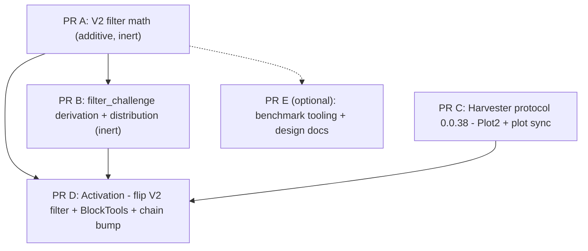

# V2 Plot Filter — PR Split Plan

Goal: split the `v2-plot-filter` branch into small, reviewable PRs against `main`.
This document is self-contained: current state, slice contents, ordering, the
test-chain problem that dictates the structure, and how to verify nothing is lost.

Read `docs/plans/plot_filterv2.md` first — it is the authoritative in-repo
description of the feature (filter formula, filter_challenge windows, strength
schedule, protocol flow, remaining gaps). CHIP-48 is the external spec.

## 0. The constraint that shapes this split: cached test chains

This determines the whole structure, so read it before the slices.

- Test chains are pickled `FullBlock` lists generated by BlockTools
  (`tools/pytest -m build_test_chains`), cached in `~/.chia/blocks`, and on CI
  downloaded from a `Chia-Network/test-cache` GitHub release tagged
  `BLOCKS_AND_PLOTS_VERSION` (declared in `.github/workflows/test-single.yml` and
  `benchmarks.yml`).
- `chia/_tests/blockchain/test_build_chains.py::test_validate_*` **byte-compares**
  the cached chains against freshly generated BlockTools output. Any change that
  alters what BlockTools produces fails CI until chains are regenerated and a new
  test-cache release is published.
- The cached chains ALREADY contain V2-plot blocks: `main`'s BlockTools farms 40 V2
  plots, and the `HARD_FORK_3_0` / `HARD_FORK_3_0_AFTER_PHASE_OUT` consensus modes
  set `HARD_FORK2_HEIGHT=0` (see `blockchain_constants` in
  `chia/_tests/conftest.py`). On `main` those V2 blocks pass the OLD prefix-bits V2
  filter (`NUMBER_ZERO_BITS_PLOT_FILTER_V2=5`).

Consequences:

1. **Yes, this change requires generating new chains with BlockTools.** The branch
   changes both how V2 proofs are selected during farming and how V2 blocks
   validate, so the old cached chains become invalid in HF3 modes. That is why the
   branch bumped `BLOCKS_AND_PLOTS_VERSION` 0.45.20 → 0.45.24 while `main` is now at
   0.45.21.
2. **The behavior flip must be atomic.** You cannot land "new validation" and "new
   BlockTools farming" in separate PRs: whichever lands first fails the byte-compare
   or fails to validate cached V2 blocks. So the split is: additive/no-op PRs first,
   then ONE activation PR that flips the V2 filter behavior, updates BlockTools,
   regenerates chains, and bumps the version — all together.
3. The regenerated 0.45.24 cache was built from the branch as-is. After rebasing the
   slices onto current `main` (which moved to 0.45.21 via PR #20909 and other
   changes), **do not assume 0.45.24 is still byte-correct** — regenerate on top of
   the final activation branch and publish a fresh release (requires write access to
   `Chia-Network/test-cache`).

Chain regeneration procedure (activation PR only):

```bash
rm -rf ~/.chia/blocks          # or move aside
tools/pytest -m build_test_chains
tools/pytest chia/_tests/blockchain/test_build_chains.py   # validate byte-equality
# package ~/.chia/blocks (+ plots dir as in previous releases) and publish as a new
# Chia-Network/test-cache release; bump BLOCKS_AND_PLOTS_VERSION in both workflows
```

## 1. Current state (verify before starting)

- Branch: `v2-plot-filter`, 14 commits ahead of `origin/main`
  (`6ef5251a1e..13aea7bfb6`), merge base `4e555bb45d`. Diff: 48 files, +1536/−243.
- The commits are NOT clean slices — "bump chains", "fix tests", "fix v2 weight
  proof validation" touch all concerns. Split by file/hunk from the cumulative
  diff; do not cherry-pick commits.
- Uncommitted work that BELONGS in the split (staged + unstaged — the
  "filter math alignment" work):
  - `chia/types/blockchain_format/proof_of_space.py` — effective filter bits
    (relative strength, 13-bit / 8192 cap), `calculate_min_plot_strength` helper
  - `chia/consensus/default_constants.py` — `MIN_PLOT_STRENGTH` back to 2
  - `chia/harvester/harvester_api.py`, `chia/simulator/block_tools.py` — use the
    new helpers
  - `chia/_tests/core/custom_types/test_proof_of_space.py` — updated/new tests
- Local-only files that must NOT go into any PR:
  - `.cursor/**`, `AGENTS.md`, `EDC_AGENTS.md`,
    `chia-blockchain_DIFFERENTIAL_REVIEW_2026-06-29.md`
  - `height-to-hash`, `sub-epoch-summaries` (blockchain DB artifacts)
  - `pytest.ini` (local debug tweak: `log_cli=True`, `log_level=INFO`)
  - `chia-blockchain-gui` submodule pointer change (confirm with author)
  - `docs/plans/chat.txt`, `docs/plans/*.jsonl` (chat log / raw benchmark dumps)

### Pre-flight (mandatory)

```bash
# 1. recoverable snapshot of the dirty tree (does not touch the working tree)
SHA=$(git stash create "pre-split")
[ -n "$SHA" ] && git update-ref "refs/backup/pre-split-$(date +%s)" "$SHA"

# 2. freeze an immutable comparison target: commit ALL intended uncommitted
#    changes (the files listed above, NOT the local-only files) on a copy branch
git checkout -b v2-plot-filter-full v2-plot-filter
git add chia/types/blockchain_format/proof_of_space.py \
        chia/consensus/default_constants.py \
        chia/harvester/harvester_api.py \
        chia/simulator/block_tools.py \
        chia/_tests/core/custom_types/test_proof_of_space.py
git commit -m "wip: filter math alignment (min-strength, effective bits)"
```

`v2-plot-filter-full` is the reference everything is verified against in §4.
Stage only named files/hunks (`git add -p` for shared files). Never `git add .`.
Do not delete `v2-plot-filter` or the backup ref.

## 2. The slices



A and C are independent off `main` and can be opened in parallel. B stacks on A
(imports `FILTER_WINDOW_SIZE`). D stacks on A+B+C and is the only PR that changes
consensus behavior or chains. "Inert" means: code lands but nothing calls it on the
consensus path yet, so generated chains are byte-identical (verified in §4).

---

### PR A — V2 filter math and identity derivation (additive, no behavior change)

New pure functions plus their unit tests. `verify_and_get_quality_string` gains the
new keyword args but its V2 branch KEEPS the old prefix-bits filter — the switch to
the new filter happens in PR D.

Files (hunks from `chia/types/blockchain_format/proof_of_space.py`):

- `FILTER_WINDOW_SIZE`, `MAX_EFFECTIVE_PLOT_FILTER_BITS`, `_BASE_FILTER_OFFSETS`
- `compute_plot_group_id()`, `compute_plot_group_id_from_pos()`
- `passes_plot_filter_v2()` (mask/xor formula per CHIP-48)
- `calculate_base_plot_filter_bits()` (height schedule relative to
  `HARD_FORK2_HEIGHT`)
- `calculate_effective_plot_filter_bits()` =
  `min(base + max(0, strength − MIN_PLOT_STRENGTH), 13)` — 8192 cap,
  relative-strength semantics
- `calculate_min_plot_strength()` (fixed for now, TODO schedule),
  `calculate_max_plot_strength()`
- `verify_and_get_quality_string` signature only: add
  `filter_challenge: bytes32 | None = None` and
  `signage_point_index: int | None = None` kwargs, unused for now (defaults mean no
  caller changes)

Do NOT include in A: the constants changes (`NUMBER_ZERO_BITS_PLOT_FILTER_V2` 5→9,
`MAX_PLOT_STRENGTH` 32→17) — changing them changes prefix filtering / plot
acceptance of existing V2 chain blocks, which breaks the byte-compare. They move to
PR D.

Tests: the `chia/_tests/core/custom_types/test_proof_of_space.py` hunks covering the
new functions (filter formula, group id, base/effective bits, min/max strength).
Hunks asserting new end-to-end `verify_and_get_quality_string` behavior move to D.

Verify: `tools/pytest chia/_tests/core/custom_types/test_proof_of_space.py` plus the
no-op canary in §4.

---

### PR B — filter_challenge derivation and distribution (stacks on A, inert)

How the sub-slot-based `filter_challenge` is derived and delivered. Validation
receives it but ignores it until PR D, so this is a no-op for consensus.

Files:

- `chia/full_node/full_node_store.py` — `get_filter_challenge()` (live derivation;
  window [0-15] → SS(n−2), [16-63] → SS(n−1))
- `chia/consensus/get_block_challenge.py` — `get_filter_challenge_from_chain()`
  (same value re-derived from `BlockRecord.finished_challenge_slot_hashes` during
  sync; imports `FILTER_WINDOW_SIZE` from A)
- `chia/protocols/farmer_protocol.py` — `NewSignagePoint.filter_challenge:
  bytes32 | None = None` (trailing optional field) + protocol regen (§3.2)
- `chia/full_node/full_node.py` — attach `filter_challenge` to both
  `NewSignagePoint` broadcast sites
- `chia/full_node/full_node_api.py` — look up `filter_challenge` in
  `declare_proof_of_space` and pass it to `verify_and_get_quality_string`
- `chia/consensus/pot_iterations.py` — pass-through kwargs on
  `validate_pospace_and_get_required_iters`
- `chia/consensus/block_header_validation.py`,
  `chia/consensus/multiprocess_validation.py` — compute `filter_challenge` for
  `proof_of_space.version == 1` (0-based: that means V2 plots!) and pass it down
- `chia/timelord/iters_from_block.py` — `height_agnostic=True` + comment
- Tests: `chia/_tests/core/full_node/stores/test_full_node_store.py`
  (`TestGetFilterChallenge`), `chia/_tests/timelord/test_timelord.py`, protocol
  regen files for `farmer_protocol`.

`farmer_api.py` consumption of `sp.filter_challenge` goes to PR D, not here.

---

### PR C — Harvester protocol 0.0.38: Plot2 and plot sync V2 (independent, off main)

Plot metadata (`plot_index`, `meta_group`) end-to-end through plot sync. No
dependency on the filter math, no consensus impact.

Files:

- `chia/protocols/harvester_protocol.py` — full diff:
  `NEW_PLOT_SERIALIZATION_VERSION (0.0.38)` / `supports_new_plot_serialization`,
  `Plot2`, `RespondPlots2`, `PlotSyncPlotList2`, `NewSignagePointHarvester2`
  (its `filter_challenge` field is only consumed in PR D; keeping the message
  definitions together avoids a second regen churn)
- `chia/protocols/shared_protocol.py` — HARVESTER protocol version → 0.0.38
- `chia/protocols/protocol_message_types.py` (`respond_plots2=113`,
  `plot_sync_loaded2=112`), `chia/protocols/protocol_message_type_to_node_type.py`,
  `chia/server/rate_limit_numbers.py`
- `chia/apis/farmer_stub.py`, `chia/apis/harvester_stub.py`
- `chia/plot_sync/sender.py`, `receiver.py`, `delta.py`
- `chia/plotting/prover.py` — real `plot_index` / `meta_group` from the prover
- `chia/harvester/harvester.py`
- `chia/farmer/farmer_api.py` — ONLY these hunks: `respond_plots2` /
  `plot_sync_loaded2` handlers, `PlotSyncPlotList2` import, old/new-harvester
  version predicates (`>= 0.0.38`)
- `chia/farmer/farmer_rpc_api.py`
- Tests: `chia/_tests/plot_sync/test_sender.py`,
  `chia/_tests/harvester/test_harvester_protocol.py` (new file), the
  `test_harvester_api.py` hunks about plot serialization, protocol regen (§3.2).

---

### PR D — Activation: flip the V2 filter, BlockTools farming, chain bump

The single consensus-behavior PR. Everything here is coupled by the chain
byte-compare (§0) and must land together.

Files:

- `chia/types/blockchain_format/proof_of_space.py` — switch the V2 branch of
  `verify_and_get_quality_string` to the predictable filter: min/max strength via
  the helpers, `passes_plot_filter_v2` with `calculate_effective_plot_filter_bits`,
  reject V2 when `filter_challenge`/`signage_point_index` are missing (unless
  `height_agnostic`), remove the prefix-bits path for V2
- `chia/consensus/default_constants.py` — `NUMBER_ZERO_BITS_PLOT_FILTER_V2` 5→9
  (now the BASE filter bits), `MAX_PLOT_STRENGTH` 32→17, dead-constant TODO comment
  (net `MIN_PLOT_STRENGTH` stays 2 relative to main)
- `chia/farmer/farmer_api.py` — remaining hunks: forward `filter_challenge` into
  `NewSignagePointHarvester2`, add `filter_challenge`/`signage_point_index` to both
  `verify_and_get_quality_string` calls, "partail"→"partial" typo fix
- `chia/harvester/harvester_api.py` — full diff: V2 branch of
  `_plot_passes_filter` (min-strength cutoff, effective bits, filter-challenge
  handling), includes the previously staged/unstaged refinements
- `chia/simulator/block_tools.py` — full diff: V2 proof selection using
  prev-tx-height-based strength/filter and the helpers
- `chia/full_node/weight_proof.py` — skip `validate_finished_header_block` for V2
  blocks in recent-chain validation; `height_agnostic` V2 path in
  `_validate_pospace_recent_chain`
- Tests: `chia/_tests/weight_proof/test_weight_proof.py`, remaining
  `test_proof_of_space.py` hunks (end-to-end verify behavior), remaining
  `test_blockchain.py` / `test_full_node.py` / `test_harvester_api.py` /
  `test_farmer_api.py` hunks (consensus-mode gates, V2-aware expectations, removed
  `limit_consensus_modes` markers)
- `.github/workflows/benchmarks.yml`, `.github/workflows/test-single.yml` —
  `BLOCKS_AND_PLOTS_VERSION` bump to the NEWLY published release (§0.3; do not
  blindly reuse 0.45.24)

---

### PR E (optional) — Benchmark tooling and design docs (stacks on A)

Only if the team wants these in-repo:

- `tools/benchmarks/__init__.py`, `tools/benchmarks/v2_plot_strength.py` (imports
  `calculate_effective_plot_filter_bits` — hence stacks on A)
- `docs/plans/plot_filterv2.md`, `docs/plans/v2-plot-strength-benchmark.md`,
  `docs/plans/v2-plot-filter-tasks.md`
- Exclude `docs/plans/chat.txt` and the `.jsonl` dumps.

## 3. Cross-cutting mechanics

1. **Shared files need hunk-level splits** (`git add -p`): `farmer_api.py`
   (C vs D), `proof_of_space.py` (A vs D), `test_proof_of_space.py` (A vs D),
   `test_harvester_api.py` (C vs D). Re-read every hunk against the slice
   descriptions.
2. **Protocol test-data regeneration.** After any `chia/protocols/*.py` message
   change, run `tools/py -m chia._tests.util.build_network_protocol_files` and
   commit the updated `chia/_tests/util/` files (`network_protocol_data.py`,
   `protocol_messages_bytes-v1.0`, `protocol_messages_json.py`,
   `test_network_protocol_*`, `test_replace_str_to_bytes.py` if touched). Do it
   per-PR (B: farmer_protocol, C: harvester_protocol) so each PR's regen output
   matches only its own messages.
3. **`proof_of_space.version` is 0-based**: `version == 1` means a V2 plot. Easy to
   misread when routing validation hunks.
4. **Do not lose the open work.** Two known gaps are documented but NOT implemented
   (see `docs/plans/plot_filterv2.md` "Remaining Gaps"): (a) `_expected_plot_size`
   in `chia/consensus/pos_quality.py` does not scale with plot strength, so
   higher-strength plots win fewer blocks (eligibility skew, benchmark-confirmed);
   (b) the `MIN_PLOT_STRENGTH` height schedule (`calculate_min_plot_strength` is
   fixed). Neither is part of this split; file follow-up tickets.

## 4. Verifying the split is complete (nothing missing, nothing leaked)

Run these checks in order; all of them are cheap except the last.

### 4.1 File accounting

Every file in the branch diff must be claimed by exactly one PR (or the exclusion
list). Mechanical check:

```bash
git diff --name-only origin/main...v2-plot-filter-full | sort > /tmp/all_files.txt
# compare against the union of the per-PR file lists in §2 (plus exclusions);
# any file not claimed by a slice is a planning bug — update this doc first
```

### 4.2 Integration equivalence (the real "nothing missing" test)

After creating all slice branches, merge them into one integration branch and diff
against the frozen reference:

```bash
git checkout -b split-integration origin/main
git merge --no-ff pr-a pr-b pr-c pr-d   # and pr-e if used
git diff split-integration v2-plot-filter-full -- . \
  ':(exclude).cursor' ':(exclude)pytest.ini' ':(exclude)docs/plans/chat.txt' \
  ':(exclude)docs/plans/*.jsonl'
```

This diff must be EMPTY (workflow chain-version lines may differ if a fresh
test-cache release was published — that difference is expected and correct). Any
other output is a dropped or altered hunk: find which slice owns it and fix that
slice, then re-run. Iterate until empty.

### 4.3 Inert-slice canary (chains must not change before PR D)

PRs A, B, C claim to be no-ops for consensus. Prove it on each slice branch with the
byte-compare test against the OLD chain cache (the version currently in that
branch's workflow file):

```bash
tools/pytest chia/_tests/blockchain/test_build_chains.py::test_validate_default_400
```

If this fails on A, B, or C, that slice accidentally changed consensus or BlockTools
behavior — a hunk belongs in D instead.

### 4.4 Per-PR test gates

- A: `tools/pytest chia/_tests/core/custom_types/test_proof_of_space.py` + §4.3
- B: A's gate + `tools/pytest chia/_tests/core/full_node/stores/test_full_node_store.py chia/_tests/timelord/test_timelord.py chia/_tests/util/test_network_protocol_files.py` + §4.3
- C: `tools/pytest chia/_tests/plot_sync chia/_tests/harvester chia/_tests/util/test_network_protocol_files.py chia/_tests/util/test_network_protocol_json.py` + §4.3
- D: regenerate chains (§0), then
  `tools/pytest chia/_tests/blockchain/test_build_chains.py` (byte-compare against
  the NEW cache), `tools/pytest chia/_tests/core/custom_types/test_proof_of_space.py
  chia/_tests/core/farmer chia/_tests/harvester chia/_tests/weight_proof`, and let
  full CI run `test_blockchain.py` / `test_full_node.py` across all consensus modes
  (HF3 modes are the ones that exercise V2 plots).

### 4.5 Suite parity

Finally, run the identical test selection on `split-integration` and on
`v2-plot-filter-full` (same chain cache for both) and compare pass/fail sets. Any
divergence means a slice interaction differs from the original branch.
