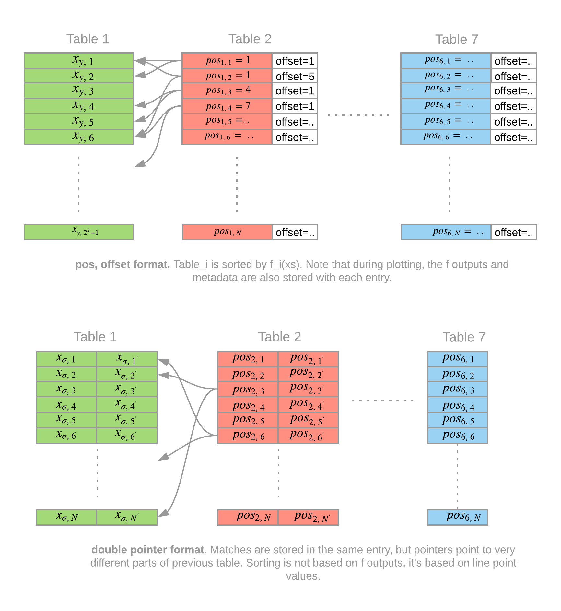
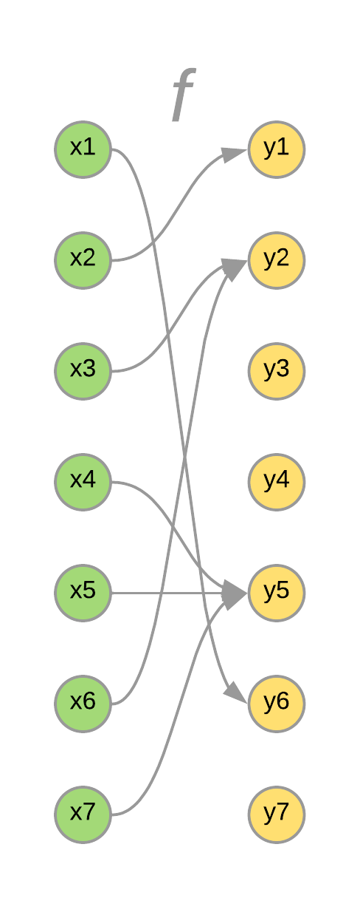
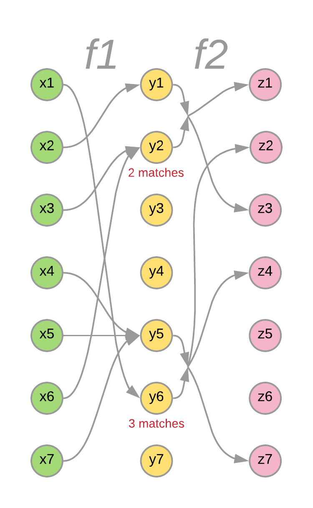
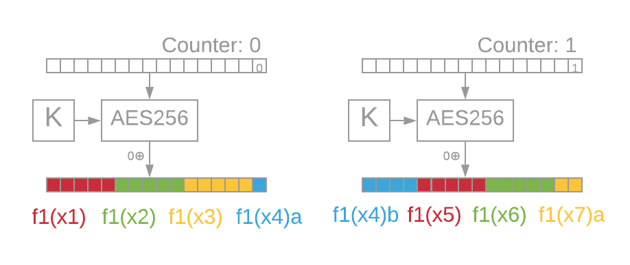

# Chia Proof of Space Construction

## Introduction

In order to create a secure blockchain consensus algorithm using disk space, a Proof of Space is scheme is necessary.
This document describes a practical contruction of Proofs of Space, based on [Beyond Hellman’s Time-Memory Trade-Offs
 with Applications to Proofs of Space](https://eprint.iacr.org/2017/893.pdf) [1].
We use the techniques laid out in that paper, extend it from 2 to 7 tables, and tweak it to make it efficient and secure, for use in the Chia Blockchain.
The document is divided into three main sections: [What](#What-is-Proof-of-Space) (mathematical definition of a proof of space), [How](#How-do-we-implement-Proof-of-Space) (how to implement proof of space), and [Why](#Construction-Explanation-Why) (motivation and explanation of the construction) sections.
The [Beyond Hellman](https://eprint.iacr.org/2017/893.pdf) paper can be read first for more mathematical background.


- [Chia Proof of Space Construction](#Chia-Proof-of-Space-Construction)
  - [Introduction](#Introduction)
  - [What is Proof of Space?](#What-is-Proof-of-Space)
      - [Definitions](#Definitions)
      - [Proof format](#Proof-format)
      - [Proof Quality String](#Proof-Quality-String)
      - [Definition of parameters, and $\mathbf{M}, f, \mathcal{A}, \mathcal{C}$ functions:](#Definition-of-parameters-and-mathbfM-f-mathcalA-mathcalC-functions)
        - [Parameters:](#Parameters)
        - [$f$ functions:](#f-functions)
        - [Matching function $\mathbf{M}$:](#Matching-function-mathbfM)
        - [$\large \mathcal{A'}$ function:](#large-mathcalA-function)
        - [$\large \mathcal{A_t}$ function:](#large-mathcalAt-function)
        - [Collation function $\mathcal{C}$:](#Collation-function-mathcalC)
  - [How do we implement Proof of Space?](#How-do-we-implement-Proof-of-Space)
    - [Plotting](#Plotting)
      - [Plotting Tables (Concepts)](#Plotting-Tables-Concepts)
        - [Tables](#Tables)
        - [Table Positions](#Table-Positions)
        - [Compressing Entry Data](#Compressing-Entry-Data)
        - [Delta Format](#Delta-Format)
        - [ANS Encoding of Delta Formatted Points](#ANS-Encoding-of-Delta-Formatted-Points)
        - [Stub and Small Deltas](#Stub-and-Small-Deltas)
        - [Parks](#Parks)
        - [Checkpoint Tables](#Checkpoint-Tables)
      - [Plotting Algorithm](#Plotting-Algorithm)
        - [Final Disk Format](#Final-Disk-Format)
        - [Full algorithm](#Full-algorithm)
        - [Phase 1: Forward Propagation](#Phase-1-Forward-Propagation)
        - [Phase 2: Backpropagation](#Phase-2-Backpropagation)
        - [Phase 3: Compression](#Phase-3-Compression)
        - [Phase 4: Checkpoints](#Phase-4-Checkpoints)
        - [Sort on Disk](#Sort-on-Disk)
        - [Plotting Performance](#Plotting-Performance)
        - [Space Required](#Space-Required)
    - [Proving](#Proving)
      - [Proof ordering vs Plot ordering](#Proof-ordering-vs-Plot-ordering)
      - [Proof Retrieval](#Proof-Retrieval)
      - [Quality String Retrieval](#Quality-String-Retrieval)
      - [Proving Performance](#Proving-Performance)
    - [Verification](#Verification)
  - [Construction Explanation (Why)](#Construction-Explanation-Why)
    - [Blockchain consensus summary](#Blockchain-consensus-summary)
    - [AACKPR17](#AACKPR17)
    - [7 Tables](#7-Tables)
    - [Collation of Inputs](#Collation-of-Inputs)
    - [Inlining Islands](#Inlining-Islands)
    - [Matching Function Requirements](#Matching-Function-Requirements)
    - [Minimum and maximum plot sizes](#Minimum-and-maximum-plot-sizes)
    - [Expected number of proofs](#Expected-number-of-proofs)
    - [Using AES256 and RRAES128](#Using-AES256-and-RRAES128)
    - [Fx custom mode](#Fx-custom-mode)
    - [Quality String](#Quality-String)
    - [Plot seed](#Plot-seed)
    - [Plotting algorithm cache locality](#Plotting-algorithm-cache-locality)
  - [Potential Optimizations](#Potential-Optimizations)
    - [Variable Sized Parks](#Variable-Sized-Parks)
    - [Cycles attack](#Cycles-attack)
    - [Hellman Attacks](#Hellman-Attacks)
    - [Dropping bits in x values / line points](#Dropping-bits-in-x-values--line-points)
    - [Reduce Plotting Space overhead](#Reduce-Plotting-Space-overhead)
    - [Mixing passes](#Mixing-passes)
    - [Every pos_R value is used at least once](#Every-posR-value-is-used-at-least-once)
    - [Pruning bad x values](#Pruning-bad-x-values)
    - [Replotting Attack](#Replotting-Attack)
    - [Reduce Checkpoint table size](#Reduce-Checkpoint-table-size)
    - [Faster Disk](#Faster-Disk)
    - [Multithreading](#Multithreading)
  - [References](#References)


## What is Proof of Space?

#### Definitions

* $[X]$ denotes the set $\{0, 1, ..., X-1\}$
* $AES_{256}(c, K) : [2^{128}] \rightarrow [2^{128}]$ is a 14 (13+1) round AES256 encryption with a 256-bit key $K$.
* $AES_{128}(c; K) : [2^{128}] \rightarrow [2^{128}]$ is a 2 (2+0) round AES128 encryption with a 128-bit key $K$
* $e$ is the natural logarithm
* $\ll, \gg$ are bitwise left-shift and right-shift operators
* $\%$ is the modulus operator
* $\text{divmod}(x, m) = (\lfloor \frac{x}{m} \rfloor, x \% m)$
* $\oplus$ denotes bitwise-XOR operation
* $x \mathbin{\|} y$ denotes zero-padded concatenation: for the implied domain $y \in [2^z]$, it is $(x \ll z) + y$
* $\underset{b}{\text{trunc}}(x)$ = the first (most significant) $b$ bits of $x$.  If $x \in [2^z]$ is the implied domain, equal to $x \gg (z - b)$.
* $x[a:b]$ If $x$ has implied domain $[2^z]$, then this is the $a^{\text{th}}$ to $(b-1)^{\text{th}}$ bits of $x$ taken as a number, where the first (most significant) bit is considered the $0^{\text{th}}$.  Equal to $(x \gg (z - b))\text{ }\%\text{ }(1 \ll (b-a))$.
For example, $(0b100100)[2:5]$ on implied domain $[2^6]$ is $0b010 = 2$.
Also, the default values are $a=0$ and $b=z$ if they are not specified.

#### Proof format
For a given $\text{plot\_seed} \in [2^{256}]$, a space parameter $33 \leq k \leq 59$, and a challenge $\text{Chall} \in [2^{256}]$ chosen by a verifier, a proof of space ${\Large\pi}$ is $64k$ bits:

${\Large\pi}_{\text{Chall; plot\_seed, k}} = x_1, x_2, ..., x_{64}$ (with $x_i \in [2^k]$) satisfying:

$$
\begin{aligned}
\mathbf{M}(f_1(x_1), f_1(x_2)), \mathbf{M}(f_1(x_3), f_1(x_4)), \dots &\small\text{ [32 matches: } (x_1, x_2), (x_3, x_4), (x_5, x_6), \cdots]\\

\mathbf{M}(f_2(x_1, x_2), f_2(x_3, x_4)), \mathbf{M}(f_2(x_5, x_6), f_2(x_7, x_8)), \dots &\small\text{ [16 matches: } (x_1, \dots, x_4), (x_5, \dots, x_8), \cdots]\\

\mathbf{M}(f_3(x_1, x_2, x_3, x_4), f_3(x_5, x_6, x_7, x_8)), \dots &\small\text{ [8 matches: } (x_1, \dots, x_8), (x_9, \dots, x_{16}), \cdots]\\

\mathbf{M}(f_4(x_1, \dots, x_8), f_4(x_9, \dots, x_{16})), \dots &\small\text{ [4 matches: } (x_1, \dots, x_{16}), (x_{17}, \dots, x_{32}), \cdots]\\

\mathbf{M}(f_5(x_1, \dots, x_{16}), f_5(x_{17}, \dots, x_{31})), \dots &\small\text{ [2 matches: } (x_1, \dots, x_{32}), (x_{33}, \dots, x_{64})]\\
\mathbf{M}(f_6(x_1, \dots, x_{32}), f_6(x_{33}, \dots, x_{64})) &\small\text{ [1 match]}\\
\underset{k}{\text{trunc}}\big(\text{Chall} \big) = \underset{k}{\text{trunc}}\big(f_7(x_1, x_2, \dots, x_{64})\big) &\\
\end{aligned}
$$

(All the $\mathbf{M}$ matching functions return $\text{True}$.)

Here,
* $\mathbf{M}(x, y)$ is a *matching function* $\mathbf{M} : [2^{k+param\_EXT}] \times [2^{k+param\_EXT}] \rightarrow \{\text{True}, \text{False}\}$;
* $f$ is a high level function that composes $\mathcal{A}$ with $\mathcal{C}$;
* $\mathcal{A'}$ and $\mathcal{A_t}$ are high level *hash functions* that call $AES_{256}$ or $AES_{128}$ on their inputs in some way, using the plot seed as a key
* $\mathcal{C}$ is a *collation function* $\mathcal{C}_t : \underset{(2^{t-2} \text{times})}{[2^k] \times \cdots \times [2^k]} \rightarrow [2^{bk}]$ for $b = \text{colla\_size}(t)$
* Plot seed is an initial seed that determines the plot and proofs of space

#### Proof Quality String
The quality string (which can be used for blockchain consensus) for a valid proof ${\Large\pi}_{\text{Chall; plot\_seed, k}}$ is defined as
 $x_{2a+1} \mathbin{\|} x_{2a+2}$ where $a=Chall  \%  32$, and the $x$ values are sorted in plot order. [Plot ordering](#Proof-ordering-vs-Plot-ordering) is a permutation of ${\Large\pi}$ $x$ values into ${\Large\pi}'$ $x'$ values such that:

$$
  \text{for s in } [1, 2, 3, 4, 5] \text{ for i in } [0, \dots, 2^{6-s}-1], \text{ in order}
$$
$$
    L = [x_{i*2^{s}+1}, \dots,
    x_{i*2^{s}+2^{s-1}}] , R= [x_{i*2^{s}+2^{s-1}+1}, \dots,  x_{(i+1)*2^{s}}]
$$

$L$ and $R$ are switched, iff $L < R$, compared element-wise, from first to last.

#### Definition of parameters, and $\mathbf{M}, f, \mathcal{A}, \mathcal{C}$ functions:


##### Parameters:

We have the following parameters, precalculated values, and functions:
$$
\begin{aligned}
\text{param\_EXT} &= 5\\
\text{param\_M} &= 1 \ll \text{param\_EXT} = 32\\
\text{param\_B} &= 60\\
\text{param\_C} &= 509\\
\text{param\_BC} &= \text{param\_B} * \text{param\_C}\\
\text{param\_c1} = \text{param\_c2} &= 10000\\
\text{bucket\_id}(x) &= \big\lfloor\frac{x}{\small\text{param\_BC}}\big\rfloor\\
\text{b\_id}(x), \text{c\_id}(x) &= \text{divmod}(x \% \text{param\_BC}, \text{param\_C}) \\
\text{colla\_size(t)} &=
\begin{cases}
1 &\text{if } t = 2\\
2 &\text{if } t = 3 \text{ or } t = 7\\
3 &\text{if } t = 6\\
4 &\text{if } t = 4 \text{ or } t = 5\\
\text{undefined} &\text{else}
\end{cases}
\end{aligned}
$$

##### $f$ functions:

For convenience of notation, we have functions $f_1, f_2, \cdots f_7$ with:

$$
\begin{aligned}

f_t &: \underset{(2^{t-1} \text{times})}{[2^k] \times \cdots \times [2^k]} \rightarrow [2^{k + \small\text{param\_EXT}}]
\\

f_1(x_1) &= \mathcal{A}'(x_1)\\

f_2(x_1, x_2) &= \mathcal{A}_2(\mathcal{C}_2(x_1), \mathcal{C}_2(x_2)) \oplus f_1(x_1)\\

f_3(x_1, x_2, x_3, x_4) &= \mathcal{A}_3(\mathcal{C}_3(x_1, x_2), \mathcal{C}_3(x_3, x_4)) \oplus f_2(x_1, x_2)\\

f_4(x_1, \dots, x_8) &= \mathcal{A}_4(\mathcal{C}_4(x_1, \dots, x_4), \mathcal{C}_4(x_5, \dots, x_8)) \oplus f_3(x_1, \dots, x_4)\\

f_5(x_1, \dots, x_{16}) &= \mathcal{A}_5(\mathcal{C}_5(x_1, \dots, x_8), \mathcal{C}_5(x_9, \dots, x_{16})) \oplus f_4(x_1, \dots, x_8)\\

f_6(x_1, \dots, x_{32}) &= \mathcal{A}_6(\mathcal{C}_6(x_1, \dots, x_{16}), \mathcal{C}_6(x_{17}, \dots, x_{32})) \oplus f_5(x_1, \dots, x_{16})\\

f_7(x_1, \dots, x_{64}) &= \mathcal{A}_7(\mathcal{C}_7(x_1, \dots, x_{32}), \mathcal{C}_7(x_{33}, \dots, x_{64})) \oplus f_6(x_1, \dots, x_{32})\\
\end{aligned}
$$

##### Matching function $\mathbf{M}$:

Then the matching function $\mathbf{M}$ is:
$$
\begin{aligned}
\mathbf{M}(l, r) &: [2^{k+param\_EXT}] \times [2^{k+param\_EXT}] \rightarrow \{\text{True},
\text{False}\}\\
\\
\mathbf{M}(l, r) &=
\begin{cases}
\text{True} & \text{if } {\small \text{bucket\_id}(l) + 1 = \text{bucket\_id}(r)}\\
& \text{and } \exists m : 0 \leq m < \text{param\_M with:}\\
& \text{b\_id}(r) - \text{b\_id}(l) \equiv m \pmod{\text{param\_B}} \text{ and}\\
& \text{c\_id}(r) - \text{c\_id}(l) \equiv (2m + (\text{bucket\_id}(l) \% 2))^2 \pmod{\text{param\_C}}\\

\text{False} & \text{else}
\end{cases}
\end{aligned}
$$

##### $\large \mathcal{A'}$ function:

$$
\begin{aligned}
\mathcal{A'}(x) = (AES_{256}(0, plot\_seed) \mathbin{\|} AES_{256}(1, plot\_seed) \mathbin{\|} ... )[kx : kx + k] \mathbin{\|} (x \text{1}\% \text{param\_M})& \\
\end{aligned}
$$
$$
\begin{aligned}
\Rightarrow \mathcal{A}'(x) =
\begin{cases}
AES_{256}(q, plot\_seed)[r:r+k]  \mathbin{\|} (x \text{1}\% \text{param\_M}) &\text{if } r+k \leq 128\\
AES_{256}(q, plot\_seed)[r:] \mathbin{\|} AES_{256}(q+1)[:r+k-128]  \mathbin{\|} (x \text{1}\% \text{param\_M})&\text{else}\\
\end{cases}
\end{aligned}
$$

for $(q, r) = \text{divmod}(x*k, 128)$.

##### $\large \mathcal{A_t}$ function:

$$
\begin{aligned}
\mathcal{A}_t(x, y) := {
\begin{cases}
\underset{k+\text{param\_EXT}}{\text{trunc}}\big( A(x \mathbin{\|} y) \big) &\text{if } 0 \leq \text{size} \leq 128 \\

\underset{k+\text{param\_EXT}}{\text{trunc}}\big( A(A(x) \oplus y) \big) &\text{if } 129 \leq \text{size} \leq 256 \\

\underset{k+\text{param\_EXT}}{\text{trunc}}\big( A(A(x_{high}) \oplus A(y_{high}) \oplus A(x_{low} \mathbin{\|} y_{low})) \big) &\text{if } 257 \leq \text{size} \leq 384 \\

\underset{k+\text{param\_EXT}}{\text{trunc}}\big( A(A(A(x_{high}) \oplus x_{low}) \oplus A(y_{high}) \oplus y_{low}) \big) &\text{if } 385 \leq \text{size} \leq 512  \\
\end{cases}
}
\end{aligned}
$$

where
$$
\begin{aligned}
A(c) &= AES_{128}(c, \underset{128}{\text{trunc}}(plot\_seed)) \\
x_{high}, x_{low} &= \text{divmod(}x\text{, 1 }\ll\text{ 128)}\\
y_{high}, y_{low} &= \text{divmod(}y\text{, 1 }\ll\text{ 128)}\\
\text{size} &= 2 * k * \text{colla\_size}(t)\\
\end{aligned}
$$

##### Collation function $\mathcal{C}$:

$$
\begin{aligned}
\mathcal{C}_{t}(x_1, ..., x_{2^{t-2}}) := {
\begin{cases}
  x_1 &\text{if } t = 2\\

  x_1 \mathbin{\|} x_2 &\text{if } t = 3\\

  x_1 \mathbin{\|} x_2 \mathbin{\|} x_3 \mathbin{\|} x_4 &\text{if } t = 4\\

  (x_1 \mathbin{\|} \dots \mathbin{\|} x_4) \oplus (x_5 \mathbin{\|} \dots \mathbin{\|} x_8) &\text{if } t = 5\\

  \underset{3k}{\text{trunc}}\big( (x_1 \mathbin{\|} \dots \mathbin{\|} x_4) \oplus (x_5 \mathbin{\|} \dots \mathbin{\|} x_8) \oplus
                (x_9 \mathbin{\|} \dots \mathbin{\|} x_{12}) \oplus (x_{13} \mathbin{\|} \dots \mathbin{\|} x_{16}) \big) &\text{if } t = 6\\
  = (x_1 \mathbin{\|} x_2 \mathbin{\|} x_3) \oplus (x_5 \mathbin{\|} x_6 \mathbin{\|} x_7) \oplus (x_9 \mathbin{\|} x_{10} \mathbin{\|} x_{11})  \oplus (x_{13} \mathbin{\|} x_{14} \mathbin{\|} x_{15}) \\

  \underset{2k}{\text{trunc}}\big( (x_1 \mathbin{\|} \dots \mathbin{\|} x_4) \oplus \cdots \oplus (x_{29} \mathbin{\|} \dots \mathbin{\|} x_{32}) \big) &\text{if } t = 7\\

  = (x_1 \mathbin{\|} x_2) \oplus (x_5 \mathbin{\|} x_6) \oplus \cdots \oplus (x_{29} \mathbin{\|} x_{30})
\end{cases}
}
\end{aligned}
$$


## How do we implement Proof of Space?

Proof of space is composed of three algorithms: [plotting](#Plotting), [proving](#Proving) and [verication](#Verification).

### Plotting

#### Plotting Tables (Concepts)

*Plotting* is our term for the method of writing data to disk such that we can quickly retrieve 1 or more proofs (if they exist) for a given challenge.
The *plot* refers to the contents of the disk. While proof retrieval must be fast, the plotting process can take time, as it is only done once, by the prover.
In the Chia Blockchain, these provers are referred to as *farmers*, since they create and maintain the plots.
That is, a farmer creates and efficiently stores data on disk, for a given *plot seed*, that allows them to find proofs $\Large{\Pi}$ that meet the above requirements.
We first discuss general concepts related to the problem of plotting.

##### Tables

There are 7 tables, each with $O(2^k)$ entries, where $k$ is the space parameter. Each table has information for finding $x_i$'s that fulfill the *matching condition* of that table and all previous tables.


For convenience, we will denote the new matching condition introduced at each table: $\mathbf{M_1}(x_1, x_2) = \mathbf{M}(f_1(x_1), f_1(x_2))$ for the first table, $\mathbf{M}_2(x_1, x_2, x_3, x_4) = \mathbf{M}(f_2(x_1, x_2), f_2(x_3, x_4))$ for the second table, and so on.

We will also refer to the total matching conditions of a table and all previous tables:
$$
\widetilde{\mathbf{M}}_t(x_1, \dots, x_{2^t}) = \widetilde{\mathbf{M}}_{t-1}(x_1, \dots, x_{2^{t-1}}) \land
\widetilde{\mathbf{M}}_{t-1}(x_{2^{t-1} + 1}, \dots, x_{2^{t}}) \land
\mathbf{M}_t(x_1, \dots, x_{2^t})
$$

Tables conceptually are broken down into a sequence of *entries* that represent $x_i$ tuples that satisfy these total matching conditions.  For example, each entry of the third table has information on recovering $(x_1, \dots, x_8)$ tuples such that $\widetilde{\mathbf{M}}_3(x_1, \dots, x_{8})$ is $\text{True}$, ie. $\mathbf{M}_3(x_1, \dots, x_8), \mathbf{M}_2(x_1, \dots, x_4), \mathbf{M}_2(x_5, \dots, x_8), \mathbf{M}_1(x_1, x_2), \cdots, \mathbf{M}_1(x_7, x_8)$ are all $\text{True}$.

We also refer to the left and right *halves* of $x_i$ tuples: if we have an entry representing tuple $(x_1, \dots, x_{2^t})$, then the halves are $\text{left\_half} = (x_1, \dots, x_{2^{t-1}})$ and $\text{right\_half} = (x_{2^{t-1} + 1}, \dots, x_{2^t})$.

These entries can also be ordered, so that (relative to some ordering $\sigma$):

$$
\text{Table}_{t; \sigma} = E_{\{t, 0\}},  E_{\{t, 1\}}, \cdots, E_{\{t, N_t - 1\}}
$$

where $N_t$ is the number of entries in the $t^{\text{th}}$ table.

The final table, $T_7$, is special, in that it does not contain information for a matching condition, but instead stores $f_7$ bits, which we will refer to as the *final outputs* of the plot.
The farmer must be able to look up final outputs efficiently, using the challenge, and the data format used to achieve this is described in [Checkpoints](#checkpoint-tables).


##### Table Positions

For each entry, instead of writing the $x_i$ data, we refer to the position of that entry in the previous table.

For example, in the third table, each entry conceptually is $E_{\{3, i\}} = (\text{left\_half}: (x_1, x_2, x_3, x_4), \text{right\_half}: (x_5, x_6, x_7, x_8))$, but we can store it instead as $E_{\{3, i\}} = (\text{left\_half}: E_{\{2, j_1\}}, \text{right\_half}: E_{\{2, j_2\}})$ for some $j_1, j_2$.

This makes it clear that (given we have stored all previous tables), storing $j_1, j_2 \in N_{t-1}$ is sufficient to recover $E_{\{t, i\}}$.


##### Compressing Entry Data

We have points (positions to the previous table) $(j_1, j_2) \in N_t$ that we want to compress.  Actually, because we can recover the order of these indices (by checking $\mathbf{M}(\dots)$ later), we only need to store the set of them: ie., store $(\max(j_1, j_2), \min(j_1, j_2))$ as data from a discrete uniform distribution (as we will see) in the "triangle space" $\text{Triangle}_t = \{(x,y) | x, y \in [N_t], x > y\}$.
Since $x$ is always greater, you can imagine these entries as random points in a two dimensional $N_t$ by  $N_t$ triangle.

We can exhibit a bijection from this space to a line $\text{Line}_t = \Big[\frac{(N_t - 1)(N_t - 2)}{2}\Big]$:

$$
\begin{aligned}
(x, y) \in \text{Triangle}_t \Rightarrow& \frac{x(x-1)}{2} + y \in \text{Line}_t\\

p \in \text{Line}_t \Rightarrow& \Big(x, p - \frac{x(x-1)}{2}\Big) \in \text{Triangle}_t, \text{where } x = \Big\lfloor \frac{\sqrt{8p + 1} + 1}{2} \Big\rfloor\\

\end{aligned}
$$

(Note:
this data is not actually in a discrete uniform distribution (eg. no line points are repeated), though we will see that this has a negligible effect.)

We can compress these points in $\text{Line}_t$, referred to as $line\_points$, by converting them to delta format, then encoding them with ANS.

##### Delta Format

Suppose we have a set of $K$ points from a discrete uniform distribution: $x_1, x_2, \dots, x_K$ chosen independently from $[RK]$.  (In our specific case, we have $N_t$ points from $\text{Line}_t$).  Here, $R$ is a "space to entries ratio" parameter.

We can sort these points and store only the deltas: $\delta_i = x_{i-1} - x_{i}$ for $i = 1, \dots, K$ (and $x_0 = 0$).
It is clear that from these deltas, we can recover the set of points.
We say that the points are in *delta format* if we are storing these deltas instead of points.

##### ANS Encoding of Delta Formatted Points

We can encode these deltas (from points in a discrete uniform distribution) using an Asymmetric Numeral System (ANS [4]) encoding, an encoding scheme that is essentially lossless and offers extremely fast compression and decompression speeds for fixed distributions.  A requirement to do so is that we know the distribution of $\Delta_i$.  From mathematics pertaining to order statitics, it can be proved that the pdf (probability density function) of $\delta$ is independent of $i$, and equal to:

$$
P(\Delta_i = X; R) =
\begin{cases}
1 - (\frac{e-1}{e})^{\frac{1}{R}} & \text{if }X = 0\\
(e^{\frac{1}{R}} - 1)(e-1)^{\frac{1}{R}}(e^{\frac{-(X+1)}{R}})& \text{else}\\
\end{cases}
$$

##### Stub and Small Deltas

In the previous discussion, the $\Delta_i$'s are approximately $\Delta_i \approx N_t \approx 2^k$ for line points of size $2^{2k}$, makes certain compression and decompression operations infeasible.  To mitigate this, we convert $\Delta_i$'s to "stub and small delta" form:

$$
(\delta_i, \text{stub}_i) = \text{divmod}(\Delta_i, 1 \ll (k-2))
$$

After, we can write the stubs directly, and an encoding of the $\delta_i$'s.  The distributions of $\text{stub}_i \in [2^{k-2}]$ and $\delta_i \in [(N_t - 1)(N_t - 2) \gg (k-1)]$ are approximated (to a negligible error) by the discrete uniform distribution on these domains, which is important for our use of ANS.

We can also calculate the appropriate space to entries ratio parameter for the current table:

$$
R_t = \frac{(N_t-1)(N_t-2)}{N_t * 2^{k-1}} \approx 2\Big(\frac{N_t}{2^k}\Big)
$$

##### Parks

For each table $t$, we often have the need to efficiently find the $i$-th entry in that table: an element of $\text{Line}_t$.

Our strategy is to group these entries into parks: $\text{param\_EPP} = 2048$ entries per park (EPP), so that:

$$
\text{Park}_i \text{ encodes } E_{\{t, i * \text{param\_EPP}\}}, E_{\{t, i * \text{param\_EPP} + 1\}}, \dots, E_{\{t, i * \text{param\_EPP} + \text{param\_EPP} - 1\}}
$$

Each park encodes information about its entries ($e_0, e_1, \dots$) as follows:

- The value of the first entry $e_0 \in \text{Line}_t$;
- The $(\text{param\_EPP} - 1)$  $\Delta$'s:
  - The $(\text{param\_EPP} - 1)$ $\text{stub}$'s, written directly [$k-2$ bits per stub];
  - The $(\text{param\_EPP} - 1)$ $\delta$'s, ANS encoded;

Then, to find the $i^\text{th}$ entry in the park, we can find the $r^\text{th}$ entry in $\text{Park}_q$, where $(q, r) = \text{divmod}(i, \text{param\_EPP})$.

One wrinkle with this system is that it is highly desired that each park starts at a fixed location on disk.  One simple way to achieve this is to allocate more than enough space to store the ANS encoding of the $\delta$'s.  Because the variance of $H(\delta)$ is very low as a percentage of the total disk space of the park (where $H$ represents Shannon entropy), this is a reasonable strategy, as the wasted space is very small.

We can bound the probability that the parks have sufficient space to store these entries, by calculating the mean and standard deviation of the information content in an entire park:

$$
\begin{aligned}
\mu &= \sum_{X \in P(X; R)} -P(X) \log_2 P(X) \\
\sigma &= \sqrt{\sum_{X \in P(X; R)} P(X) ((-\log_2 P(X)) - \mu)^2} \\
\hat{\mu} &= \mu * (\text{\small param\_EPP} - 1) \\
\hat{\sigma} &= \sigma * \sqrt{\text{\small param\_EPP} - 1} \\
\end{aligned}
$$

For eg. $R = 1.0$ and $\text{param\_EPP} = 2048$, we have $\hat{\mu} = 3885.33, \hat{\sigma} = 52.21$.  Because $\text{InverseCDF}[\text{NormalDistribution}[0,1], (99.9\%)^{2^{-40}}] < 8.0$, we can choose a park size of $\hat{\mu} + 8 \hat{\sigma}$ to have an approximately 99.9% chance to store a single table of $2^{40}$ entries.

More complicated systems of writing parks to disk are possible that offer minor compression improvements, based on recovering the endpoints of parks that have been coalesced.  For a more thorough discussion, see [Variable Sized Parks](#Variable-sized-parks).

##### Checkpoint Tables

Retriving a proof of space for a challenge, as explained in [Proving](#Proving), requires efficienty looking up a final output $f_7$ in the final table.
Therefore, in $\text{Table}_7$ entries are sorted by $f_7$.
In order to compress the on disk representation, we can store deltas between each $f_7$, which are small, since there are approximately $2^k$ uniformly distributed integers of size $k$.

We can efficiently encode these deltas with a variable scheme like Huffman encoding. For simplicity, we allocate a fixed amount of space for encoding deltas for $param\_c_1 = 10000$ entries, and allow 3 bits per delta to prevent overflows, storing them in parks.

However, every $param\_c_1$ entries, the $f_7$ will drift away from the position in the table, for example entry 10,000 might be stored in position 10,245, so we store a checkpoint every $param\_c_1$ entries, in a new table, $C_1$.
Furthermore, since these checkpoints do not fit in memory for a large $k$, we can store an additional checkpoint every $param\_c_2$ $C_1$ entries, in yet a new table, $C_2$.
Since there will be approximately $\frac{2^k}{c_{1}*c_{2}}$ $C_2$ entries, we can store these in memory.

#### Plotting Algorithm

##### Final Disk Format

Let $pos_{t;L}$ and $pos_{t;R}$ denote the positions in $Table_t$ of a $\text{Table}_{t+1}$ entry.
That is, a $Table_{t+1}$ entry is composed of two indeces into $Table_t$.

$f_7$ is a final output of function $f_7$, which is compared to the challenge at verification. The $N$ values (number of entries in a table) are calculated in the [Space Required](#space-required) section.
The final format is composed of a table that stores the original $x$ values, 5 tables that store positions to the previous table, a table for the final outputs, and 3 small checkpoint tables.

The final disk format is the following:

| Table       | Data                                | Disk Storage                                         | Approximate N                       |
| ----------- | ----------------------------------- | ---------------------------------------------------- | ----------------------------------- |
| $Table_{1}$ | $E_{\{1, i\}}=x_L, x_R$             | Mapped to line point, deltafied, encoded, and parked | $0.798*2^k$                         |
| $Table_{2}$ | $E_{\{2, i\}}=pos_{1;L}, pos_{1;R}$ | Mapped to line point, deltafied, encoded, and parked | $0.801*2^k$                         |
| $Table_{3}$ | $E_{\{3, i\}}=pos_{2;L}, pos_{2;R}$ | Mapped to line point, deltafied, encoded, and parked | $0.807*2^k$                         |
| $Table_{4}$ | $E_{\{4, i\}}=pos_{3;L}, pos_{3;R}$ | Mapped to line point, deltafied, encoded, and parked | $0.823*2^k$                         |
| $Table_{5}$ | $E_{\{5, i\}}=pos_{4;L}, pos_{4;R}$ | Mapped to line point, deltafied, encoded, and parked | $0.865*2^k$                         |
| $Table_{6}$ | $E_{\{6, i\}}=pos_{5;L}, pos_{5;R}$ | Mapped to line point, deltafied, encoded, and parked | $2^k$                         |
| $Table_{7}$ | $E_{\{7, i\}}=pos_{6;L}$            | Parked                                               | $2^k$                               |
| $C_{1}$     | $f_7$                               | Byte aligned storage                                 | $\frac{2^k}{param\_c_1}$            |
| $C_{2}$     | $f_7$                               | Byte aligned storage                                 | $\frac{2^k}{param\_c_1*param\_c_2}$ |
| $C_{3}$     | $f_7$                               | Deltafied, encoded, and parked                       | $\frac{2^k}{param\_c_1}$            |

##### Full algorithm
The plotting algorithm $\text{PlotAlgo1}$ takes as input a unique $\text{plot\_seed} \in [2^{256}]$, a space parameter $33 \leq k \leq 60$, a param object $param$, and deterministically outputs a final file $F$.

$Sort$, or sort on disk, takes in a table on disk, and performs a full ascending sort, starting at a specified bit position.

```python
# 1 Forward propagation phase
For x in 0...2^k - 1:
    Compute f1(x)
    Write (f1(x), x) to table1

For table in 1..6:
      Sort tablei by (fi(x), pos, offset). for table1, by f1(x)
      For entry in tablei:
            if entries L and R match:
                  Compute fi+1(CL, CR)  for table1, M=x
                  C = Collation_i(CL, CR)
                  Store (fi+1, pos, offset, C) in tablei+1

# 2 Backpropagation phase
For table in 6..1:
      Iterate through tablei and tablei+1:
           Drop unused entries in tablei
           sort_key = table == 7 ? fi : tablei+1pos
           Rewrite used entries in tablei as (sort_key, pos, offset)
           Rewrite entries in tablei+1 as (sort_key, pos, offset)
      If i > 1:
           Sort tablei by (pos, offset)

# 3 Compression phase
For table in 1..6:
      Iterate through tablei and tablei+1:
           Read sort_key, pos, offset from tablei+1
           Read tablei entries in that pos and offset:  eL, eR
           y, x = sort(eL.newPos, eR.newPos)
           line_point = x*(x-1)//2 + y
           Rewrite tablei+1 entry as (line_point, sort_key)
      Sort tablei+1 by line_point
      For entry e, i in enumerate(tablei+1):
           newPos = i
           Rewrite e as (sort_key, newPos)
           Write compressed e.line_point deltas to table Pi
      Sort tablei+1 by sort_key

# 4 Checkpoints phase
For entries in table7:
      Compress f7 entries into C1,C2,C3 tables
      Write pos6 entries to table P7k

```

##### Phase 1: Forward Propagation

The purpose of the forward propagation phase is to compute all tables where the matching conditions are met, and to compute all final outputs $f_7$.
For each $Table_i$, we compute the correspoding $f$ function on the $x$ values (actually on the collated values), and write the outputs to disk to $Table_{i+1}$, along with the corresponding positions in $Table_i$, and the collated $x$ values.

Then, $Sort$ is performed on the new table, to sort it by output $f_i$.
This allows us to check for the matching condition efficiently, since matching entries will have adjacent $bucket\_id$s.
Matches can be found by using a sliding window which reads entries from disk, one group at a time.
$C_3$ to $C_7$ refers to the output of the collation functiod for each n

File $T$ will store the following data after phase 1:

| Table   | Data           | Disk storage  |
| ----- |:-------------|:-----|
| $Table_1$     | $f_1, x$ | Sorted by f_1|
| $Table_2$     | $f_2, pos_{1;L}, offset, C_3$ | Sorted by $(f_2, pos_{1;L}, offset)$|
| $Table_3$     | $f_3, pos_{2;L}, offset, C_4$ | Sorted by $(f_3, pos_{2;L}, offset)$|
| $Table_4$     | $f_4, pos_{3;L}, offset, C_5$ | Sorted by $(f_4, pos_{3;L}, offset)$|
| $Table_5$     | $f_5, pos_{4;L}, offset, C_6$ | Sorted by $(f_5, pos_{4;L}, offset)$|
| $Table_6$     | $f_6, pos_{6;L}, offset, C_7$ | Sorted by $(f_6, pos_{5;L}, offset)$|
| $Table_7$     | $f_7, pos_{6;L}, offset$ | Sorted by $(pos_{6;L},offset)$|

Pointers in Phase 1 and 2 are stored in <strong>pos, offset format</strong>.
Pos offset format represents a match, by storing a $k+1$ bit position, and a much smaller 9 or 10 bit offset.

Duting phase 1, entries are close to their matches, so storing the offset is efficient.
This will change into <strong>double pointer format</strong>, which stores two $k$ bit pointers,
but uses sorting and compression to reduce each entry: to a size much closer to $k$.


##### Phase 2: Backpropagation

Note that after phase 1, the temporary file is sufficient to create proofs of space. $f_7$ can be looked up, and the tables can be followed backwards until the $x$ values in $Table_1$ are reached.
However, this is not space efficient.

The purpose of the backpropagation step is to remove data which is not useful for finding proofs.
During this phase, all entries which do not form part of the matching condition in the next table, are dropped.
Positions in the next table are adjusted to account for the dropped entries.
The Collation outputs ($C$ values) are also dropped, since they are only useful for forward propagation.
For a more efficient compression phase, each entry is given a $sort\_key$, which corresponds to it's position in the table.
This is more efficient than storing $(f_t, pos_{t-1}, offset)$ to represent it's position.

Implementation of this phase requires iterating through two tables at once, a left and a right table, checking which left entries are used in the right table, and dropping the ones that are not.
Finally, a sort by position is required before looking at the right table, so it's possible to read a window into both tables at once, in a cache-local manner, without reading random locations on disk.

File $T$ will store the following data after phase 2:

| Table   | Data           | Disk storage  |
| ----- |:-------------|:-----|
| $Table_1$     | $f_1, x$ | Sorted by f_1|
| $Table_2$     | $sort\_key, pos_{1;L}, offset$ | Sorted by $(pos_{1;L}, offset)$|
| $Table_3$     | $sort\_key, pos_{2;L}, offset$ | Sorted by $(pos_{2;L}, offset)$|
| $Table_4$     | $sort\_key, pos_{3;L}, offset$ | Sorted by $(pos_{3;L}, offset)$|
| $Table_5$     | $sort\_key, pos_{4;L}, offset$ | Sorted by $(pos_{4;L}, offset)$|
| $Table_6$     | $sort\_key, pos_{5;L}, offset$ | Sorted by $(pos_{5;L}, offset)$|
| $Table_7$     | $f_7, pos_{6;L}, offset$ | Sorted by $(pos_{6;L}, offset)$|


##### Phase 3: Compression

The purpose of phase 3 is to convert from the (pos, offset) format, which requires tables to be sorted according to their $bucket\_ids$ for retrieval, to a double pointer format, which allows storing entries in a more compressed way, and sorts by $line\_point$.
In the pos offset format around k bits are required for the pos and 8 bits for the offset, for a total of around $k+8$ bits per entry, whereas in double pointer format, we can average around 2 bits per entry overhead.



With the compressed format, two pointers can be stored in around $k+2$ bits, using the strategies described in [Compressing Entry Data](#compressing-entry-data).


The goal for the double pointer format is to store two $k$ bit pointers to a previous table ($2k$ bits of information), as compactly as possible.
This is achieved by having each entry $E_{t, i}$ be represented as pointers to the previous table, where the previous table is sorted by [$line\_point$](#Compressing-Entry-Data). This makes positions random (i.e. it’s no longer sorted by matches/$bucket\_id$).
Then we take these $2k$ bit $line\_points$, and encode the deltas between each one, each which will be around $k$ bits.
This phase requires some careful sorting and [mapping](#Plotting-algorithm-cache-locality) from old positions to new positions, since we don't have as much memory as disk space.

As we iterate from $Table_1$ to $Table_7$, the compression is performed, and each compressed table is written to the final file $F$.

File $T$ will store the following data after phase 3:

| Table   | Data           | Disk storage  |
| ----- |:-------------| :----|
| $Table_1$     | $f_1, x$ | Sorted by f_1|
| $Table_2$     | $sort\_key, new\_pos$ |  Sorted by $sort\_key$|
| $Table_3$     | $sort\_key, new\_pos$ | Sorted by $sort\_key$|
| $Table_4$     | $sort\_key, new\_pos$ | Sorted by $sort\_key$|
| $Table_5$     | $sort\_key, new\_pos$ | Sorted by $sort\_key$|
| $Table_6$     | $sort\_key, new\_pos$ | Sorted by $sort\_key$|
| $Table_7$     | $f_7, new\_pos$ | Sorted by $f_7$|

File $F$ will store the [final format](#final-disk-format) after phase 3, except for $Table_7$ and the checkpoint tables.

The main bottlenecks in the reference implementation are searching for matches, and sorting on disk.

##### Phase 4: Checkpoints
Phase 4 involved iterating through $T.Table_7$, writing $F.Table_7$, and compressing the $f_7$s into the
[checkpoint tables](#checkpoint-tables).

##### Sort on Disk

Sort on disk is an external sorting algorithm that sorts large amounts of data with significantly less memory that the data size.
On large plots, this function quickly becomes the bottleneck of the plotting algorithm.
It works by recursively dividing data into smaller partitions, until there is enough memory to a partition in memory.
Data is grouped into partitions by the first $4$ unique bits of the numbers to be sorted, which means data is divided into 16 buckets.
While impractical, the simplified idea is presented below.

```python
SortOnDisk(data, bits_begin):
    If enough memory to sort data:
        SortInMemory(data, bits_begin)
    Else:
        For entry in data:
            Move entry to partition entry[bits_begin:bits_begin+4]
        For partition in 0..15:
            SortOnDisk(partition[i], bits_begin+4)
```

While partitioning data, everything must fit into memory, so we continuously extract from all 16 buckets into memory, and write back from memory into the target buckets.

Let $bucket\_sizes[i]$ the number of entries from partition (bucket) $i$, $written\_per\_bucket[i]$ the number of entries written back to partition $i$, that belong there and $consumed\_per\_bucket[i]$ the number of entries read from bucket $i$ from Disk.
We also define $disk\_begin$ as the disk position of the first entry and $entry\_len$ the total size of an entry.
We assume $bstore$ is an efficient way to store and retrieve entries in memory, grouping entries by their first 4 unique bits (their bucket).

The algorithm works by constantly filling memory by reading a few entries from each bucket, then extracting from memory and writing into the correct disk location.
At any step, number of entries written back to bucket $i$ must be smaller or equal to the number of entries read from bucket $i$ (this way no entry is overwritten).
We also write the heaviest buckets first, in order to quickly clear the memory.
When refilling the memory, we read from buckets in increasing order of $consumed\_per\_bucket[i] - written\_per\_bucket[i]$, as the smaller the difference is, the less we can extract from memory from bucket $i$ on the next step (and this optimizes the worst case).
Finally, we know the beginning of each bucket in the sorted ordering on Disk: for bucket $i$, it's $disk\_begin + \sum_{j=0}^{i-1} {bucket\_sizes[j]} * entry\_len$, so this will help to know the exact position in which to write entries from bucket $i$ on Disk.
After all the entries have been moved into their correct bucket, we call SortOnDisk on each bucket, until we can sort in memory.

Bstore is implemented as concatenated linked lists, each bucket having its own linked list.
Moreover, the empty positions inside the memory form their own linked lists as well.
```python
SortOnDisk(disk_begin, bits_begin, entry_len):
    Sort in memory if possible, otherwise do this:
    total = 0
    For i in 0..15:
        bucket_begins[i] = total
        total = total + bucket_sizes[i]
        disk_position[i] = disk_begin + bucket_begins[i] * entry_len
        Read some entries starting with disk_position[i]
        Foreach(read_entry):
            Move the entry into a spare (temporary) zone of the file
            consumed_per_bucket[i] += 1
    While (spare zone has entries and bstore is not full):
        Read one entry from the spare zone
        Store the entry into bstore
    While (bstore is not empty):
        bucket_order = range(0, 15)
        Sort bucket_order decreasingly by bucket sizes in bstore
        For b in bucket_order:
            to_extract = min(bstore.bucket_size(b),
                             consumed_per_bucket[b] - written_per_bucket[b])
            Extract to_extract entries from bucket b of bstore
            Write them on disk starting from (disk_begin+(bucket_begins[b]+written_per_bucket[b])*entry_len)
            written_per_bucket[b] += to_extract
        Sort bucket_order increasingly by consumed_per_bucket[i] - written_per_bucket[i]
        While (bstore is not full):
            Populate bstore from buckets, using the bucket_order ordering
            If all buckets are fully consumed but bstore is not full, populate from the spare zone
    For i in 0..15:
        SortOnDisk(disk_position[i], bits_begin+4, entry_len)
```

Sorting in memory is done in two ways: quicksort (when the data is not random) or our custom SortInMemory algorithm (when the data is random).

The custom SortInMemory algorithm is similar to the SortOnDisk, as each entry is put into a bucket.
The main difference is we are using twice as many buckets as the number of entries, guaranteeing that the buckets will have a sparse number of entries, and collisions will slow down the algorithm.
Since we know that the data is evenly distributed, we know approximately where each entry should go, and therefore can sort in $O(n)$ time.

Let $b$ be the smallest number such as $2^b >= 2*num\_entries$. The bucket of an entry is given by the bits from $bits\_begin$ to $bits\_begin+b$. We use the memory to store the entries into buckets: we initially try to place the entry on its bucket position. If the position is free, we simpy place the entry there. Otherwise, we place there the minimum between the current entry and the existing entry and try to place the other entry one position higher. We keep doing this until we find an empty position.

```python
SortInMemory():
	Let k be the smallest number such as 2^b >= 2 * num_entries.
	Read entries in batches.
	Foreach(entry):
		Let bucket = entry[bits_begin:bits_begin+k]
		While (bucket is not free in memory):
			Let other_entry be the entry in memory from the position bucket.
			Store in memory min(entry, other_entry) on position bucket.
			entry = max(entry, other_entry).
			bucket += 1
		Store entry in position bucket in memory.
	Iterate over memory and find occupied positions.
	Retrieve entries from them and write them in batches.
```

##### Plotting Performance

The algorithm is designed with [cache locality](#Plotting-algorithm-cache-locality) in mind, so that random disk lookups are not required,
and a large amount of memory is not necessary. The [sort on disk](#sort-on-disk-quick-sort-vs-bucketsort) algorithm will perform better if more memory is allocated.

However, multiple passes on disk are required, both in the sorts, and in the other parts of the algorithm.
On slow CPU's plotting can be CPU bound, especially since AES256 must be computed on O(2^k) values.
On newer CPU's, AES instruction sets are available, which makes that part extremely fast.
Still, comparisons, arithmetic, and memory allocation are required during plotting, which can cause the algorithm to be CPU bound.
Multi-threading can be used to split up the work, as well as to separate CPU from disk I/O.

In addition, the usage of an SSD or RAM drive can significantly speed up the plotting process.

##### Space Required

During backpropagation, each left table has $2^k$ entries, and entries with no matches are dropped. For $Table_6$ and $Table_7$,
there are $2^k$ entries in each table. Under the random edge assumption, where each combination of entries has a $2^{-2k}$ probability of existing, the probability of an entry in $Table_5$ having matches is equivalent to the probability of each match not hitting the entry, which is

$$
p_5 = 1 - (\frac{(2^k-2)}{2^k})^{2^k}
$$
Therefore, the proportion of entries not dropped from $Table_5$ is $p_5: \approx 0.865$.
For the other tables $Table_t$, the proportion of entries not dropped is:

$$
p_t = 1 - (\frac{(2^k-2)}{2^k})^{p_{t+1}2^k}
$$

Assuming we encode each line point delta in exactly k bits, that the checkpoint tables use negligible space, and that [Hellman attacks](#Hellman-Attacks) are not performed, the total size of the file $F$ will be:
$$
\begin{aligned}
Space &= k * 2^k*(1 + \sum_{t=1}^6 p_t)\text{ bits} \\
Space &= k * 2^k*(1 + 1 + 0.865 + 0.822 + 0.807 + 0.801 + 0.798)\text{ bits} \\
Space &= k * 6.09*2^k \text{ bits} \\
Space &= 0.762 * k * 2^k \text{ bytes}
\end{aligned}
$$

The total size of the temporary file $T$ will be:
$$
2^k*((k+param\_EXT + k) \\
+ 5*(k+param\_EXT + (k+1) + param\_offset\_size) \\
+ (2 + 4 + 4 + 3 + 2) * k\\
+ 2k + k \\
= 2^k*(30k + 6*param\_EXT + 5*param\_offset\_size + 5)
$$

For the proposed constants, the temporary file is around 6 times the size of the final file.

### Proving
The proving process is the process by which a farmer, someone who stores a plot, efficiently retrieves proofs from disk, given a challenge.

Suppose a farmer Alice wants to prove to a verifier Bob that she is using 1TB of data.
Bob generates a random challenge, gives it to Alice, and if Alice can immediately create a valid [proof of space](#Proof-format) for that challenge and the correct $k$ based on [the space formula](#Space-Required) using the proving algorithm, then Bob can be convinced that Alice stored that data. (Actually, Alice will only have 1 proof in expectation, so more challenges should be issued by Bob).

In the blockchain use case, there is no interactivity, but the concept of fast proving for a random challenge still applies.

#### Proof ordering vs Plot ordering

In the compression step, when two pointers to a previous table, $x$ and $y$ are compressed to a line point, they are switched if necessary, so that $x$ > $y$. This means that the original ordering of the $x$ values of $Table_1$ is lost, but we instead have a new, deterministic ordering being used on disk. The reason for this is explained in [Quality String](#quality-string).
Therefore, at the end of the proof retrieval process, the proof must be converted by evaluating matches at each level, and reordering where necessary.

#### Proof Retrieval

The proof retrieval algorithm takes in a plot file $F$, a challenge $Chall$, and returns a list of $n$ proofs
${\Large\pi}_1 \dots {\Large\pi}_n$, in time independent of the space parameter $k$.

1. Initialization step: load $k$, $table_{c2}$ into memory.
2. $target \gets \underset{k}{\text{trunc}}(chall)$.
3. Find the index of the final $c_2$ entry where $target < c_2$
4. Seek to $table_{c_1}$, based on the index from the previous step, and read $param\_c2$ entries.
5. Find the index of the final $c_1$ entry where $target < c_1$
6. Read a park from $c_3$ based on the index from the previous step
7. Find all indeces where $f_7 = target$
8. If there are no such indeces, return []
9. For each proof, recursively follow all table pointers from $table_7$ to $table_1$ and return 64 $x$ values.
10. For each proof, reorder the proof from plot ordering to proof ordering

#### Quality String Retrieval

The proof retrieval algorithm takes in a plot file $F$, a challenge $Chall$, and returns a list of $2k$ bit quality strings.

1. Perform the proof retrieval algorithm up to step 8
2. Calculate $qual\_id \gets Chall\%32$
3. Follow table pointers from $Table_6$ to $Table_1$. For each bit of $qual\_id$, if the bit is 0, follow the smaller position, and if the bit is 1, follow the larger position of the pair.
4. Retrieve two $x$ values from the $Table_1$ entry, $x_1$ and $x_2$, where $x_1 < x_2$.
5. Return $x_1 \mathbin{\|} x_2$. Note that is is equivalent to the [Proof Quality String](#proof-quality-string).


#### Proving Performance

The prover needs to be able to create proofs immediately, for blockchain consensus applications.
For challenges that don't have any proofs of space, steps 2-7 in [Proof Retrieval](#proof-retrieval) require only two disk lookups.

When proofs exist, only 6 additional disk lookups are required to find the quality, per proof.
If the whole proof needs to be fetched, it will cost around 64 disk lookups. Using the quality allows us to avoid fetching the full proof, until a good quality is found.

### Verification

Given a challenge $Chall$, a proof $\Large{\pi}$, and a space parameter $k$, a verifier can efficiently verify a proof by checking that all of the matching functions in [Proof Format](#proof-format), and that the truncated $Chall$ equals the final output.
On a successful proof, the verifier can also compute the quality string by converting the proof from proof ordering to plot ordering [Proof Quality String](#proof-quality-string).

## Construction Explanation (Why)

### Blockchain consensus summary

The motivation for Chia's proof of space construction, is for use as an alternative resource to Proof of Work, in a Namakoto-consensus style blockchain. Space miners (also referred to as farmers) allocate space on their hard drives, respond to challenges, and occasionally win rewards.
Challenges are random 256 values that result from each block.
In Chia's blockchain, this challenge is the unpredictable output of a Verifiable Delay Function that is required for each block.

In order for such a protocol to be secure against 51% attacks and other consensus attacks, it is clear that an attacker should not be able to create a proof of space for $S$ space, using $A << S$ space.
The attackers advantage over an honest farmer that implements only the main optimizations should be small.
This should be true even if the attacker has a significant amount of processing power and parallelism, as well as fast hard drives.

Furthermore, the initialization phase (plotting), should be as efficient as possible, but farmers should not be able to perform this phase within the average block interval.

Finally, prover efficiency, verifier efficiency, proof size, noninteractivity of the initialization phase, and simplicity of honest operation, are all concerns that must be taken into account, and these are some reasons for a lot of the details of the construction, explained in depth below. We will build up from the simple ideas, up to the full definition of proof of space from section 1.

### AACKPR17

This construction by [Abusalah, Alwen, Cohen, Khilko, Pietrzak and Reyzin[1]](https://eprint.iacr.org/2017/893.pdf) aims to create a simple and efficient proof of space scheme, compared to exists pebbling based PoSpace schemes.

One of the simplest ways to think about contructing a proof of space, is for the verifier to specify a random function $f : [N] \to [N]$, where $N = 2^k$, which the prover must quickly be able to invert.
The idea is that the prover can precompute this function table, sort it by output values, and be able to quickly invert any challenge given by the verifier.
For example, we can set $f(x) = H(n || x)$, where $n$ is a random nonce chosen at initialization time, and $H$ is a cryptographic hash function.



The problem  with the above construction is that the verifier can perform a Hellman Attack (time space tradeoff), where only $N^{1/2}$ checkpoint values are stored, and $N^{1/2}$ computation is performed, from the checkpoint, to the target value.

The new idea in the paper, is to construct a function $[N] \to [N]$ that can resist such attacks, by making the function hard to compute in the forward direction for a chosen input.

The function that has to be inverted is $f(x_1) = f_2(x_1, x_2)$, where $f_2(x_1, x_2) = H(x_1 || x_2)$, but with the requirement that $f_1(x_1) = f_1(x_2) + 1$, where $f_1(x)$ can be another hash function.
Given a challenge $Chall$, the prover must find $x_1$ and $x_2$.
Since we cannot efficiently compute $f(x_1)$ for any $x_1$ (without storing the $f_1$ table), Hellman attacks can be mitigated.
However, the entire $f$ function table can still be computed in quasilinear time.

In order to implement such a proof of space, we can first compute the $f_1$ table, sort by output, and find all pairs $(x_1, x_2)$ such that $f_1(x_1) = f_1(x_2)$. These can then be stored on disk and sorted by $f_2$ output.



### 7 Tables

While function $f$ above cannot be computed efficiently in the forward direction, $f_1$ can, and therefore some time space tradeoffs are possible to invert $f_1$. In order to mitigate these attacks, we can increase the number of levels/tables, $m$ in the construction, so that an attacker who optimizes just one level, will not get a massive advantage.

For example, for $m=4$ and matching function $\mathbf{M}$, given a challenge $Chall$, the prover finds $x_1, x_2, x_3, x_4, x_5, x_6, x_7, x_8$ such that:

$$
\mathbf{M}(f_1(x_1), f_1(x_2)) \land \mathbf{M}(f_1(x_3), f_1(x_4)) \land \mathbf{M}(f_1(x_5), f_1(x_6)) \land \mathbf{M}(f_1(x_7), f_1(x_8)) \\
\mathbf{M}(f_2(x_1, x_2), f_2(x_3, x_4)) \land \mathbf{M}(f_2(x_5, x_6), f_2(x_7, x_8)) \\
\mathbf{M}(f_3(x_1, x_2, x_3, x_4), f_3(x_1, x_2, x_3, x_4))\\
f_4(x_1, x_2, x_3, x_4, x_5, x_6, x_7, x_8) == \underset{k}{\text{trunc}}(Chall)
$$

Therefore $f_i$ has domain $k*2^{i-1}$ and two outputs match if the matching function $\mathbf{M}$ returns true.

Even in the cases where the attacker can invert $f_1$ with no space, the advantage gained is at most $1/m$ (since table 1 is smaller due to orphaned values).

The drawback of increasing the number of $f$ tables is that the proof size grows exponentially with the number of tables, which is inconvenient for propagation through the network.
The verification time grows exponentially, which makes it difficult to sync too many blocks.
The number of disk seeks also grows exponentially, making the proving slower, and computation of these f functions also becomes slower. The number used here is $m=7$.


### Collation of Inputs

Since increasing the number of $f$ functions makes the input sizes grow exponentially, this has a signifant performance effect even at $m=7$. Specifically, it makes the temporary storage required to compute these tables much larger than the final size of the plot file. Furthermore, it makes the plotting process require more CPU and more time.

This can be improved by collating the left and right values, using some other function than just concatenation, as in [collation](#Collation-function-mathcalC). By limiting the output of the collation function to 4 values (and the domain of the $\mathcal{A}$ functions at 8), an attacker trying to perform a Hellman attack on table 7, for example, will need to either store extra bits or perform many disk lookups.

The collation function output size can be reduced to $3k$ and $2k$ in the last two tables, since an attack which stores these values, will end up using more space than it saves.


Why the numbers $3k$ and $2k$?
Let's say we truncated the sizes to $k$ instead of $3k$ for $C_6$.
This would enable us to evaluate $f_6$ for any input, by storing all the inputs, with storage of $2k$ per entry (which can be further compressed).
This is sufficient to initiate a Hellman attack, which makes inversion of $f_6$ cheap.
By increasing this number to $3k$, the storage required to Hellman attack $f_6$ by storing the inputs is $6k$, much larger than the honest protocol's $k$ bits for $Table_6$ and $k$ bits for $Table_7$.
$2k$ and $3k$ are chose are convervative numbers, ensuring that performing time space tradeoffs is much more expensive than honest storage, for later tables.


### Inlining Islands

Using a very simple matching function, such as $M(x_1, x_2) = True \iff x_1 + 1 = x_2$, there would be a large number of small islands (around $0.14N$ for $N$ edges and $N$ nodes).
An island is a set of entries in a table, $S_I$ such that $M(E_1, E_2) \wedge E_1 \in S_I \implies E_2 \in S_I$.

Consider a plot stored in [pos, offset format](#Phase-3-Compression).  Let's assume there is an island $S_I = \{E_{t,1}, \dots, E_{t,i}\}$ in $Table_t$.
This island matches to a set of entries in $Table_{t+1}$, let's call it $Z_I=\{E_{t+1,1}, \dots, E_{t+1,j}\}$.
To compress this, we remove $S_I$ completely from $Table_t$, and place it in $Table_{t+1}$, in place of one element, $E_{t+1;1}$ of $Z_I$.
Then, for all other elements of $Z_I$, we simply point to the new pos and offset in the same $Table_{t+1}$, instead of pointing to the previous table.

This saves around $k$ bits for every island, since $E_{t+1;1}$ is no longer stored.
The drawback of this optimization is that it makes the plotting algorithm and data format more complicated, it's not straightforward to implement, and requires more passes over the plot.
The matching function should try to maximize the size of islands, making this optimiztion as insignificant possible.

The number of islands in a random graph of $N$ nodes and $N$ edges is
$$N*\sum_{k=2}^{\infty} \frac{k^{k-2}*2^{k-1}}{k!*e^{2k}} \approx 0.026N$$

Although not random, the matching function below adds more "randomness" to matches, making the number of islands very close to the random graph.
Unfortunately, during backpropagation up to 20% of entries in a table are dropped, and thus it is no longer a graph of $N$ nodes and $N$ edges.
Experimentally, this increases the number of islands to $0.06N$ or $0.07N$, and thus inlining is a viable optimization.

### Matching Function Requirements

Let's consider an *underlying graph* of a table: the digraph where each node is an entry, and an edge exists if that pair of entries is a match.

There are two main motivations for the matching function:

- Efficiency: All matches can be found efficiently.  Generally this means that:
    - the set of matches to search is quasilinear to the number of entries, and
    - the matches can be made to be local to some region of the disk, so as to minimize disk seeks.
- No small-length cycles: In the underlying graph (considering each edge as undirected), 4-length cycles don't exist, as small length cycles can be compressed later (see: [Cycles attack](#Cycles-attack))

The first requirement can be fulfilled by only matching things close together under some ordering of entries.

The second requirement is fulfilled by requiring the underlying graph to be a subset of some *overlay graph* that doesn't have small-length cycles (as any subset of this graph will also not have small-length cycles).

Focusing on the second requirement, consider for parameters $(B, C)$,  nodes from $\Z \times \Z_B \times \Z_C$, and edges in the overlay graph given by:
$$
(i, b, c) \rightarrow (i+1, b+r, c+(2r + i\%2)^2)
$$

for all $0 \leq r < 32 = \text{param\_M}$.

Consider a cycle in this graph of length $4$ (when edges are considered undirected).  We must have $2$ forward edges and $2$ reverse edges.  Thus, for the $r_i$'s of the forward edges and the $\bar r_i$'s of the reverse edges, and up to parity bits $p_i \in \{0, 1\}$ (and $\bar p_i = 1 - p_i$),

$$
\sum_{i=1}^2 r_i - \bar r_i \equiv 0 \pmod{B}\\
\\
\sum_{i=1}^2 (2r_i + p_i)^2 - (2\bar r_i + p_i)^2 \equiv 0 \pmod{C}\\
$$

With a simple program (or by careful analysis), we can verify there are no 4-cycles:

```python
from itertools import product
B, C, M = 60, 509, 32
for r1, r2, s1, s2 in product(range(M), repeat = 4):
    if r1 != s1 and (r1,r2) != (s2,s1) and (r1-s1+r2-s2) % B == 0:
        for p1, p2 in product(range(2), repeat = 2):
            assert ((2*r1+p1)**2 - (2*s1+p1)**2 +
                    (2*r2+p2)**2 - (2*s2+p2)**2) % C !=   0
```


### Minimum and maximum plot sizes

The minimum plot size is important to prevent grinding attacks.
If $k$ is small, an attacker could regenerate an entire plot in a short period of time.
For a proof of space to be valid, the proof must be generated almost immediately, and a plot size which allows generating a plot during proving, should not be possible.
There are practical considerations for choosing the minimum size as well.
If there is a plot size were its possible to use a very expensive setup (a lot of memory, CPU, etc) to quickly generate a plot, this can still work as a valid proof of space, since the cost of this attack makes it impractical.

The maximum plot size is chosen at 59, a conservative maximum even accounting for future hard drive improvements, still allowing everything to be represented in 64 bits, and keeping k-truncated AES ciphertexts difficult to invert.

### Expected number of proofs

Call a tuple $(x_1, x_2, \dots, x_{64})$ *weakly distinct* if all the following conditions hold:

$$
\begin{cases}
x_1 \neq x_2, x_3 \neq x_4, x_5 \neq x_6, \dots, x_{63} \neq x_{64}\\
(x_1, x_2) \neq (x_3, x_4), (x_5, x_6) \neq (x_7, x_8), \dots, (x_{61}, x_{62}) \neq (x_{63}, x_{64})\\
(x_1, x_2, x_3, x_4) \neq (x_5, x_6, x_7, x_8), \dots, (x_{57}, \dots, x_{60}) \neq (x_{61}, \dots, x_{64})\\
\dots\\
(x_1, x_2, \dots, x_{32}) \neq (x_{33}, \dots, x_{64})
\end{cases}
$$

Given a weakly distinct tuple $(x_1, \dots, x_{64})$ chosen uniformly at random, and modeling all functions $f_i$ as random, that tuple is a valid proof for a challenge with probability $p = 2^{-64k}$, since all matching conditions $\mathbf{M_i}$ are independent.  Also, note that the number of weakly distinct tuples is approximately $W = 2^{64k}$, as $2^k \gg 64$.

Furthermore, a tuple that is not weakly distinct cannot be a valid proof, since matches never occur for the same left and right halves (ie. $\mathbf{M}(x, x)$ is always $\text{False}$.)

Thus, the expected number of proofs per challenge is $W * p \approx 2^{64k} * 2^{-64k} = 1$.

### Using AES256 and RRAES128

A random function $f$ is required for the definition of proofs of space from [Beyond Hellman](#https://eprint.iacr.org/2017/893.pdf). $AES_{256}$, and a reduced round $AES_{128}$ ($RRAES_{128}$) are used, due to their efficient hardware implementations (AES-NI).
While the AES function to 128 bits can be easily reverted, we can reduce the output size to $k+param\_EXT$ bits, making it an irreversible function from $2^k$ to $2^{k+param\_EXT}$ bits.
We can also reuse the same ciphertext for multiple evaluations of $f(x)$.

As written in [A' function](#large-mathcalA-function), $f_1$ is evaluated by performing $AES_{256}$ on every number from 0 to $2^{k}-1$, using the $plot\_seed$ as the key, and then adding $param\_EXT$ bits from $x$, to reduce the impact of collisions on the matching function.
This is similar to counter mode in $AES$, but with a plaintext of 0, and truncating the output to k bits.
Note that each AES call results in $\frac{128}{k}$ evaluations of $f_1$.



Using counter mode with multiple outputs saves CPU time, and also allows us to evaluate $f_1$ in the forward direction, without having to store nonces.

Note that even though the key and plaintext are fixed and known, $f_1$ is a one-way function. If we have an output, like $f_1(x)$, and we want to compute the preimage without storing all of the ciphertexts, this should require a significant amount of CPU time, since we don’t know the rest of the ciphertext for that block.
If $k$ was much larger than 64, it would become practical to revert these f functions.


### Fx custom mode

For $f_2$ to $f_7$, since all the inputs are chosen based on cryptographically strong outputs from $AES_{256}$, such strong security is not necessary, as long as there is good diffusion in the function (all the inputs affect all the outputs).
Furthermore, the number of AES rounds can also be reduced to 2 (the minimum such that every input bit has an effect on every output bit).

Note that the inputs to $f_2$ to $f_7$ vary in length, so the definition needs to allow the input to be larger than one AES block.
Instead of using something like CBC mode, a custom mode (defined in [$A_t$ function](#large-mathcalAt-function)) is used, which allows caching of AES outputs.

Since matches are computed sequentially, if an entry $E$ matches with 3 other entries, and $E$ is on the right side of the match, the right half of the $f$ inputs can be identical for 3 executions of $f$, and therefore AES outputs can be cached.

Compare this with CBC, where the first time a bit changes, it affects the entire ciphertext, and therefore cached values can no longer be used. Since $E$ is on the right side, the AES plaintext for E will be on the right, and CBC will be encrypting different blocks for all three evaluations.

A potential optimization in the reference code is to take advantage of this, and cache AES values where appropriate.

Finally, $k+param\_EXT$ bits are taken from the ciphertext, and an XOR operation is performed with the first output from the previous table.
For $f_7$, the final output is obtained after encrypting, truncating, and XORing with the left $f_6$ output.
This is cheap to perform, and ensures that any weaknesses from reverting reduced round AES do not affect security, since we are XORing with a cryptographically strong output of $AES_{256}$.

### Quality String

The quality string $(x_{2a+1} \mathbin{\|} x_{2a+2})$, along with the challenge, can be hashed to create a unique random number, or "lottery ticket", to be used for blockchain consensus.

The reason why only two out of the 64 proof values are used, is that reading two $x$ values requires $6$ lookups on disk, as opposed to $64$ lookups: only one branch is followed through the tree, as opposed to every branch.
A farmer running proof of space in a blockchain, may check their plot every time they see a new block or a new challenge.
However, most of the time, they will not win the block, and their proof of space quality will not be good enough.
Therefore, we can avoid the 64 disk lookups that are required for fetching the whole proof.
Two adjacent $x$ values can be used, since they are stored together on disk, and therefore additional disk seeks are not needed compared to only reading one.

It is important that the choice of which $x$ values must be fetched depends on the challenge.
If the first two x values were always used, an attacker could compute a farmer's plot, and save $x_1, x_2$ for all the proofs in the plot, and be able to compute qualities with significantly less storage than the full plot.
This would allow the attacker, for example, to withold blocks that benefit others.

Furthermore, since the farmer does not know the challenge in advance, the qualities cannot be precomputed.

During the plotting process, entry data is [compressed](#compressing-entry-data) by reordering tuples, which means the ordering of the proof $x$ values is lost. The quality that the prover computes (by traversing back through the tables) is based on this modified ordering.
Therefore, the verifier must perform this [calculation](#Proof-Quality-String) to retrieve the efficient ordering used by the prover.

### Plot seed

The $plot\_seed$ is a 32 byte value which is used to deterministically seed the whole plot.
The 32 bytes are used as the key in $AES_{256}$ in $f_1$, and 16 of those bytes are used as the key in $AES_{128}$ in $f_2$ to $f_7$.

### Plotting algorithm cache locality

Since proof of space plots are meant to be very large (due to the minimum $k$), the plotting algorithm should require significantly less memory than disk space.
In order to accomplish this, lookup tables of size $O(N)$ should not be necessary for plotting, and random points on disk should not be read frequently.

This is particularly important in the Forward Propagation phase, where pairs of entries $E_1$ and $E_2$ must be compared for matching.
One of the matching requirements is that the $bucket\_id$ of $E_2$ is one greater than that of $E_2$.
Therefore, in the Forward Propagation phase we sort by $bucket\_id$/$f$ output.

In the Compression Phase, positions to previous table entries are based on $f$ output sorting, but to save space, they are converted to positions to tables based on [$line\_point$](#Compressing-Entry-Data) sorting.
Doing this mapping cannot be done with a lookup table, so we first sort by the new sort criteria, write the index of each new entry, and then sort by the old criteria again, so we can iterate through the next table.
A small window is used, which requires very little memory.

## Potential Optimizations

### Variable Sized Parks

The current implementation puts sections of empty space between [parks](#Parks), which is wasteful and can be used.  In the following discussion, a "house" prepends each park and contains additional metadata for that park, and recall that houses in the original scheme contained the value of the first entry $e_0$ as in the fixed width park scheme.

In an alternate scheme that has "park alignment", we'll have houses also containing a fixed number of bits to store "park alignment", and parks are written sequentially, "skipping" over the allocated space of any house.  This saves space as it mitigates the $N * 8 \sigma$ loss and replaces it with an $(\frac{N}{EPP}) * \lceil(log_2(\text{MAX\_PARK\_ALIGNMENT}))\rceil$ cost, which is substantially cheaper.

When seeking to a park, we will read some extra bits ($\text{MAX\_PARK\_ALIGNMENT}$ of them) to the left and right of the houses that delimit the park, so that we adequately cover an area enough to read the entire contents of the park.

The issue with this approach is that the maximum (absolute value) deviation of a random walk of N steps is roughly $\sqrt{N * \pi/2}$.  We expect that $\text{MAX\_PARK\_ALIGNMENT}$ would have to be way too big [bigger than the space we would like to read from disk] to compensate for these cases.

One way to solve this approach is to have a variable number of entries per park.  Specifically, suppose each park (except possibly the last) either has $EPP-1$ or $EPP+1$ entries.  For each house, we need 1 extra bit to represent this size difference of the following park, and we also need to store the sum of these size differences (-1 or 1).  The idea is that when our park alignment is negative, we make bigger parks; and when our park alignment is positive, we make smaller parks.  This reduces the expected $\text{MAX\_PARK\_ALIGNMENT}$ significantly to make this approach feasible.

Additionally on the side, we need “house hinting”.  Suppose EPP = 2048, and we want the 2500th entry.  We would guess that it is in the second park, since roughly speaking entries 1-2048 are in the first park, 2049-4096 are in the second park, and so on.  Our idea is that whenever our guess would be wrong, we create a hint in memory that specifies an interval of entries for which we should modify our guess by some number.  We can binary search this hint table before seeking to a park.

In reality, the hint table will be very small, as the size differences need to have an absolute value exceeding EPP for us to record a hint.  As an implementation level detail, we actually need to read two adjacent parks worth of information to ensure our hint table is small - if we don’t, our hint table will be very big as every change of sign between the running sum of size differences will cause a new hint for entries near the borders of each park.

### Cycles attack

Considering the *underlying graph* of a table (see [Matching Function Requirements](#Matching-Function-Requirements)), it's possible to write say, 3 of the associated entries corresponding to edges of a 4-cycle to disk, plus specify how to walk the edges of this cycle (possibly some edges walked in reverse) to find the last edge (entry).

Because there are no 4-cycles (or 5-cycles, because each edge changes the parity of the first coordinate), the minimum length cycle is a 6-cycle.

For every cycle on an island in the graph of a table it's possible to save one of the edges by specifying how to walk the edges to find the the pair instead of giving the counterpart directly.
There are two types of cycles which occur: 4-cycles which happen when there's a bucket which has two things in it and has at least two things it connects to, and 6-cycles, which can happen with two buckets with two things in them being connected but are more common as happenstance through the graph as a whole.
The cycles which depend on multiple things in the same bucket can be made much less common by increasing the degree of the graph (and correspondingly the B-group size) at the direct linear expense of CPU time.
The length of other types of cycles can be increased by increasing the C-group size, at the expense of requiring correspondingly more cache space when plotting.

### Hellman Attacks

Hellman attacks, or time space tradeoffs, refer to techniques where certain checkpoints are stored, allowing reversal of random functions using only $O(N^{2/3})$ time and
space, or different amounts based on the desired tradeoff.
As mentioned in [Beyond Hellman](#AACKPR17), this construction makes Hellman attacks less powerful, but they are still a worthwhile optimization for the first table.

The basic Hellman attack on $Table_1$ works as follows:
Instead of storing $k$ bits per entry for Tabes 1 and 2, we don't store anything for $Table_1$, and for $Table_2$, we store $x_1, x_3$ instead of $pos_l, pos_r$, which were positions into $Table_1$ for $x_1, x_2$ and $x_3, x_4$.

When looking up a quality or proof, we can evaluate $f_1(x_1)$ and $f_1(x_3)$, which will be very close to $f_1(x_2)$ and $f_1(x_4)$ respectively, due to the matching function.
This still requires inversion of $f_1$, which we attempt on each of the 32 potential $f_1$ values.

To invert, we store checkpoint chains as in [Rainbow Tables[2]](https://lasec.epfl.ch/pub/lasec/doc/Oech03.pdf), check which chain we're on, and evaluate it.

There can also be collisions and false positives, i.e we invert $f_1$ but get the wrong input.
This can be fixed by also checking that all retrieved $x$ values also match with respect to $f_2$.

If $Table_1$ is fully removed, $13\%$ of space from the final plot file is saved, which makes this potentially the most significant optimization.

A caveat of this optimization, is that it potentially requires a large amount of memory to set up the rainbow tables.
This is due to the fact that the algorithm needs the check whether each $x$ value that is being looked at, is already included or not included in the saved chains.
Furthermore, if not all $x$ values are covered, plot success rate will decrease.
In order to cover all $x$ values, a significant amount of memory is required for proving, to store all of these remaining x values.

Potentially, some tradeoffs can be performed to make the attack require less CPU and less memory, which slightly decrease the efficiency of the plot.

### Dropping bits in x values / line points

A fraction of the stored line points in $Table_1$ could have $z$ bits dropped and on recovery all possible values of the dropped bits could be brute forced.
Instead of storing deltas for $2k$ bit line points $L$, we store deltas for $\underset{k-z}{\text{trunc}}(L)$.
This saves around $\frac{z}{2}$ bits from each entry, and requires $2^z$ more computation.
To recover the line point, we find the truncated line point, and then try each possibility for the dropped bits, until we find a resulting $(x_1, x_2)$ pair such that $M(x_1, x_2)$ is true.
Note that false positives are possible, but they are rare, and can be checked by evaluting $f_2$.

This optimization, like Hellman Attacks, relies on using CPU to minimize $Table_1$.
Furthermore, it does not seem practical for anything past $Table_1$, and perhaps a few bits from $Table_2$.
If an attacker tries to truncate $z$ bits from all tables, the number of disk seeks becomes exponential (as well as the computation required).

### Reduce Plotting Space overhead

During the Forward Propagation phase, the metadata is only needed to compute the next table. Once the next table is computed, the metadata can be dropped, to save disk space.

Furthermore, for each pair of tables during Forward Propagation, the left table entries which don't lead to any matches can be immediately dropped.
Although backpropagation drops any entry which doesn't lead to an $f_7$ match, most entries can be dropped in Forward Propagation using the above stated method.

Both of these optimizations save working space, but increase the number of passes which must be performed, and thus increase plot size.
For very large plots, where sort times matter more than number of passes, these optimizations may also yield faster plot times.

### Mixing passes

Most of the time when a sort on disk is completed the final pass in memory is written out to disk. If there is an operation which must be performed on the sorted table (such as during Forward Propagation), it is more efficient to perform this operation while sorting, to minimize disk seeks, as opposed to waiting until the entire table is sorted.

### Every pos_R value is used at least once

Our method does not take into account that every $\text{pos\_R}$ value is used at least once per table, offering further compression.

To give a good approximation of the theoretical loss from not considering this information, consider a table of $N$ entries, where each entry is independently chosen as pointing to two different positions from $[N]$.  The information content of the table is $N \log \binom{N}{2}$.

Let $e_i$ be the set of tables such that no entry points to $i$.  Clearly, $|e_i| = \binom{N-1}{2}^N$, $|e_i \cap e_j| = \binom{N-2}{2}^N$, $|e_i \cap e_j \cap e_k| = \binom{N-3}{2}^N$, and so on.  Thus, by the principle of inclusion-exclusion,

$$
\begin{aligned}
\Big|\bigcup\limits_{i=1}^N e_i\Big| &= \sum\limits_{k=1}^N (-1)^{k+1} \sum\limits_{I \subseteq [N]\text{ : }|I| = k} \Big| \bigcap\limits_{i \in I} e_i \Big|\\
&= \sum\limits_{k=1}^N (-1)^{k+1} \binom{N}{k} \binom{N-k}{2}^N\\
&= \binom{N}{2}^{N} \sum\limits_{k=1}^N (-1)^{k+1} \binom{N}{k} \Big(1 - \frac{k}{N}\Big)^N \Big(1 - \frac{k}{N-1}\Big)^N\\
&\approx \binom{N}{2}^{N} \sum\limits_{k=1}^N (-1)^{k+1} \binom{N}{k} e^{-2k}\\
&= \Big(\binom{N}{2} \big(1 - e^{-2}\big)\Big)^N
\end{aligned}
$$

The information content of tables where every position is pointed to by at least one entry is $N (\log \binom{N}{2} + \log (1 - e^{-2}))$.
The difference per entry is $-\log (1 - e^{-2})$, or 0.21 bits per entry.
Therefore, this information cannot be used to significantly reduce plot size.

### Pruning bad x values

Most entries stored in the plot cannot be removed without without reducing the per-byte effectiveness of the plot. However, removing entries which lead to few or only one final solution might lead to an increase in the per-byte effectiveness. This will be a small number of entries, since the chances of finding multiple such entries that contribute to the same final output gets exponentially lower from $Table_7$ to $Table_1$.

### Replotting Attack

Some plots will by random noise have greater per-byte effectiveness. The amount of this is proportional to the square root of the size of the plot with a small constant factor so the potential gains aren't high.
Furtermore, this requires evaluating the entire forward propagatio phase.
If a farmer has multiple plots, and wants to delete one of them, the least effective one can be reclaimed first.

### Reduce Checkpoint table size

By using a more efficient encoding for storing deltas of $f_7$ values in the $C_3$ table, a theoretical maximum of up to 2 bits per entry can be saved (current size of $C_3$ table). This is around 1% for $k=33$.

### Faster Disk

Plotting on an SSD or a ramdisk will provide massive performance improvements, especially for large plots, where sort on disk becomes the bottleneck.


### Multithreading

Multithreading can provide significant performance improvements. The CPU usage of most phases is completely paralellizable, and disk I/O blocking can be minimized.


## References

[1] Hamza Abusalah, Joel Alwen, Bram Cohen, Danylo Khilko, Krzysztof Pietrzak, Leonid Reyzin: Beyond Hellman’s Time-Memory Trade-Offs
with Applications to Proofs of Space (2017) https://eprint.iacr.org/2017/893.pdf

[2] Philippe Oechslin: Making a Faster Cryptanalytic Time-Memory
Trade-Of (2013) https://lasec.epfl.ch/pub/lasec/doc/Oech03.pdf

[3] Krzysztof Pietrzak, Bram Cohen: Chia Greenpaper (2019)

[4] Mart Simisker: Assymetrical Number Systems (2017) https://courses.cs.ut.ee/MTAT.07.022/2017_fall/uploads/Main/mart-report-f17.pdf
