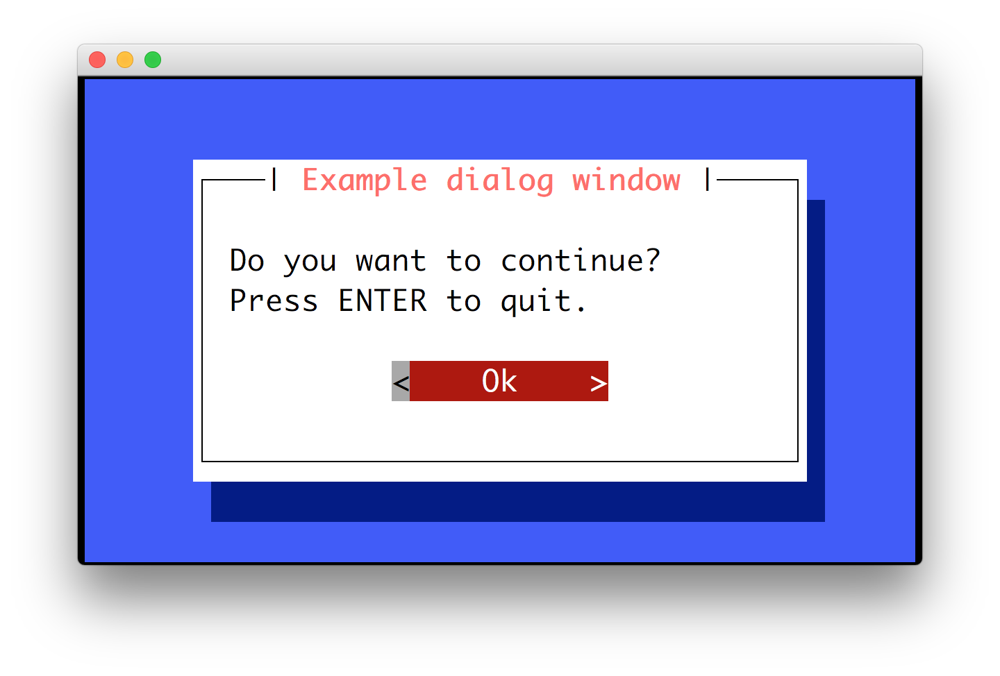
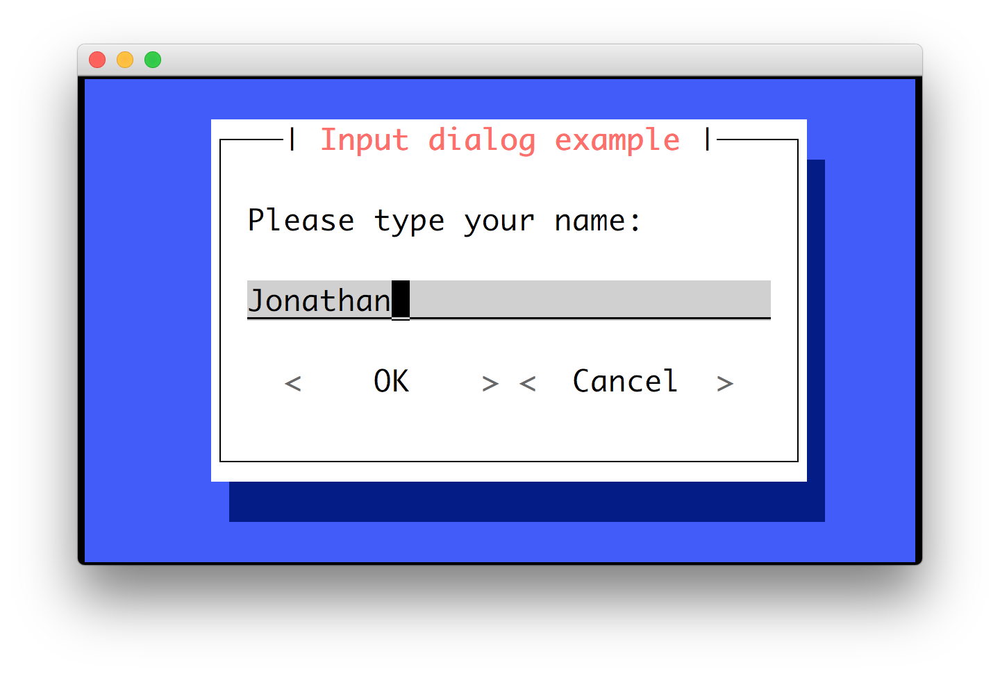
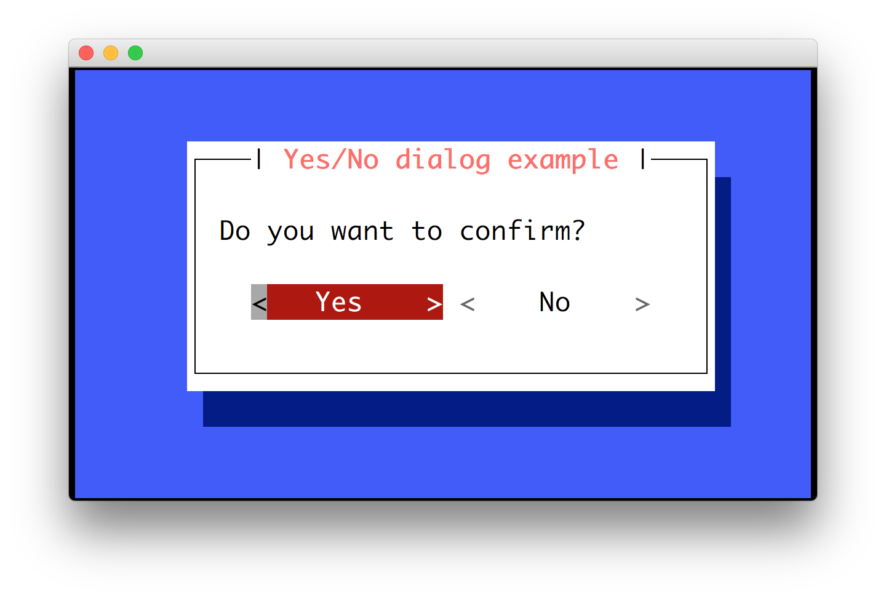
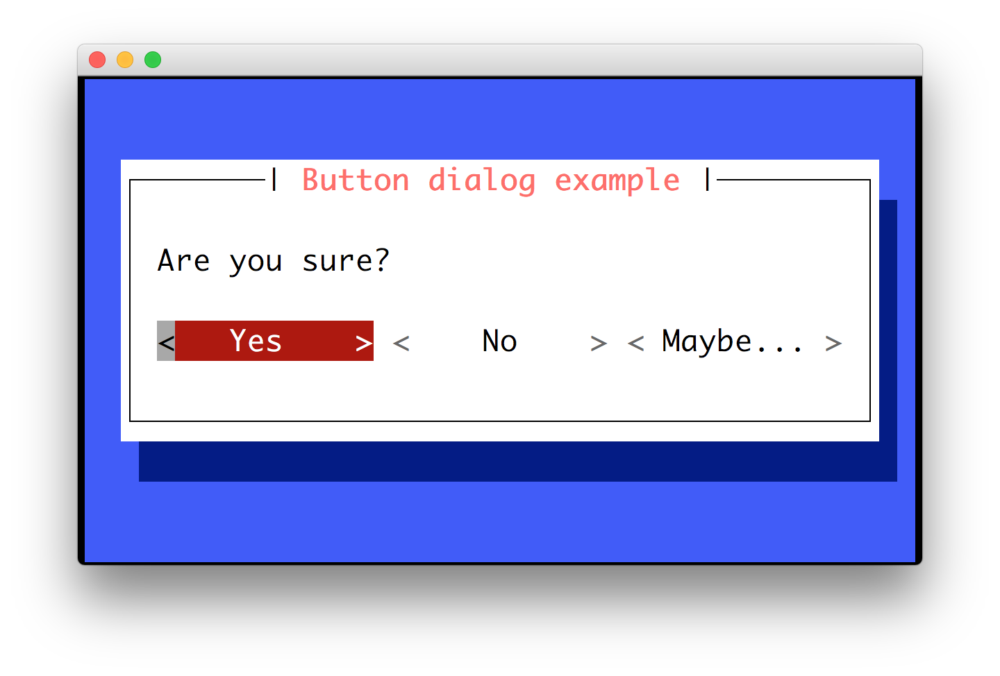
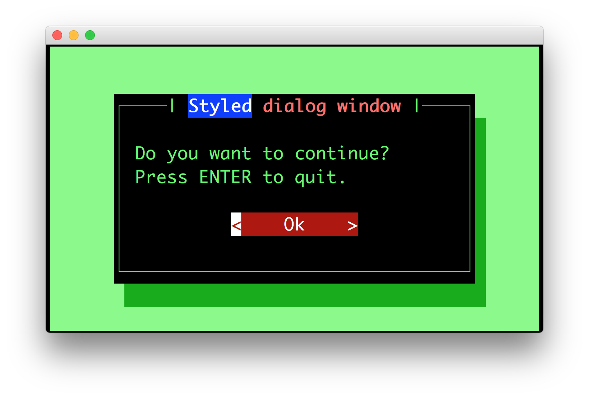

.. _dialogs:

Dialogs
=======

Prompt_toolkit ships with a high level API for displaying dialogs, similar to
the Whiptail program, but in pure Python.

Message box
-----------

Use the :func:`~prompt_toolkit.shortcuts.message_dialog` function to display a
simple message box. For instance:

.. code:: python

    from prompt_toolkit.shortcuts import message_dialog

    message_dialog(
        title='Example dialog window',
        text='Do you want to continue?\nPress ENTER to quit.').run()

Input box
---------

The :func:`~prompt_toolkit.shortcuts.input_dialog` function can display an
input box. It will return the user input as a string.

.. code:: python

    from prompt_toolkit.shortcuts import input_dialog

    text = input_dialog(
        title='Input dialog example',
        text='Please type your name:').run()

The ``password=True`` option can be passed to the
:func:`~prompt_toolkit.shortcuts.input_dialog` function to turn this into a
password input box.

Yes/No confirmation dialog
--------------------------

The :func:`~prompt_toolkit.shortcuts.yes_no_dialog` function displays a yes/no
confirmation dialog. It will return a boolean according to the selection.

.. code:: python

    from prompt_toolkit.shortcuts import yes_no_dialog

    result = yes_no_dialog(
        title='Yes/No dialog example',
        text='Do you want to confirm?').run()

Button dialog
-------------

The :func:`~prompt_toolkit.shortcuts.button_dialog` function displays a dialog
with choices offered as buttons. Buttons are indicated as a list of tuples,
each providing the label (first) and return value if clicked (second).

.. code:: python

    from prompt_toolkit.shortcuts import button_dialog

    result = button_dialog(
        title='Button dialog example',
        text='Do you want to confirm?',
        buttons=[
            ('Yes', True),
            ('No', False),
            ('Maybe...', None)
        ],
    ).run()

Radio list dialog
-----------------

The :func:`~prompt_toolkit.shortcuts.radiolist_dialog` functiom displays a dialog
with choices offered as a radio list. The values are provided as a list of tuples,
each providing the return value (first element) and the displayed value (second element).

.. code:: python

    from prompt_toolkit.shortcuts import radiolist_dialog

    result = radiolist_dialog( 
        title="RadioList dialog", 
        text="Which breakfast would you like ?", 
        values=[ 
            ("breakfast1", "Eggs and beacon"), 
            ("breakfast2", "French breakfast"), 
            ("breakfast3", "Equestrian breakfast") 
        ] 
    ).run()

Checkbox list dialog
--------------------

The :func:`~prompt_toolkit.shortcuts.checkboxlist_dialog` has the same usage and purpose than the Radiolist dialog, but allows several values to be selected and therefore returned.

.. code:: python

    from prompt_toolkit.shortcuts import checkboxlist_dialog

    results_array = checkboxlist_dialog( 
        title="CheckboxList dialog", 
        text="What would you like in your breakfast ?",
        values=[ 
            ("eggs", "Eggs"),
            ("bacon", "Bacon"),
            ("croissants", "20 Croissants"),
            ("daily", "The breakfast of the day")
        ] 
    ).run()

Styling of dialogs
------------------

A custom :class:`~prompt_toolkit.styles.Style` instance can be passed to all
dialogs to override the default style. Also, text can be styled by passing an
:class:`~prompt_toolkit.formatted_text.HTML` object.

.. code:: python

    from prompt_toolkit.formatted_text import HTML
    from prompt_toolkit.shortcuts import message_dialog
    from prompt_toolkit.styles import Style

    example_style = Style.from_dict({
        'dialog':             'bg:#88ff88',
        'dialog frame.label': 'bg:#ffffff #000000',
        'dialog.body':        'bg:#000000 #00ff00',
        'dialog shadow':      'bg:#00aa00',
    })

    message_dialog(
        title=HTML(' '
                   ' window'),
        text='Do you want to continue?\nPress ENTER to quit.',
        style=example_style).run()

Styling reference sheet
-----------------------

In reality, the shortcut commands presented above build a full-screen frame by using a list of components. The two tables below allow you to get the classnames available for each shortcut, therefore you will be able to provide a custom style for every element that is displayed, using the method provided above.

.. note:: All the shortcuts use the ``Dialog`` component, therefore it isn't specified explicitely below.

+--------------------------+-------------------------+
| Shortcut                 | Components used         |
+==========================+=========================+
| ``yes_no_dialog``        | - ``Label``             |
|                          | - ``Button`` (x2)       |
+--------------------------+-------------------------+
| ``button_dialog``        | - ``Label``             |
|                          | - ``Button``            |
+--------------------------+-------------------------+
| ``input_dialog``         | - ``TextArea``          |
|                          | - ``Button`` (x2)       |
+--------------------------+-------------------------+
| ``message_dialog``       | - ``Label``             |
|                          | - ``Button``            |
+--------------------------+-------------------------+
| ``radiolist_dialog``     | - ``Label``             |
|                          | - ``RadioList``         |
|                          | - ``Button`` (x2)       |
+--------------------------+-------------------------+
| ``checkboxlist_dialog``  | - ``Label``             |
|                          | - ``CheckboxList``      |
|                          | - ``Button`` (x2)       |
+--------------------------+-------------------------+
| ``progress_dialog``      | - ``Label``             |
|                          | - ``TextArea`` (locked) |
|                          | - ``ProgressBar``       |
+--------------------------+-------------------------+

+----------------+-----------------------------+
| Components     | Available classnames        |
+================+=============================+
| Dialog         | - ``dialog``                |
|                | - ``dialog.body``           |
+----------------+-----------------------------+
| TextArea       | - ``text-area``             |
|                | - ``text-area.prompt``      |
+----------------+-----------------------------+
| Label          | - ``label``                 |
+----------------+-----------------------------+
| Button         | - ``button``                |
|                | - ``button.focused``        |
|                | - ``button.arrow``          |
|                | - ``button.text``           |
+----------------+-----------------------------+
| Frame          | - ``frame``                 |
|                | - ``frame.border``          |
|                | - ``frame.label``           |
+----------------+-----------------------------+
| Shadow         | - ``shadow``                |
+----------------+-----------------------------+
| RadioList      | - ``radio-list``            |
|                | - ``radio``                 |
|                | - ``radio-checked``         |
|                | - ``radio-selected``        |
+----------------+-----------------------------+
| CheckboxList   | - ``checkbox-list``         |
|                | - ``checkbox``              |
|                | - ``checkbox-checked``      |
|                | - ``checkbox-selected``     |
+----------------+-----------------------------+
| VerticalLine   | - ``line``                  |
|                | - ``vertical-line``         |
+----------------+-----------------------------+
| HorizontalLine | - ``line``                  |
|                | - ``horizontal-line``       |
+----------------+-----------------------------+
| ProgressBar    | - ``progress-bar``          |
|                | - ``progress-bar.used``     |
+----------------+-----------------------------+

Example
_______

Let's customize the example of the ``checkboxlist_dialog``.

It uses 2 ``Button``, a ``CheckboxList`` and a ``Label``, packed inside a ``Dialog``.
Threfore we can customize each of these elements separately, using for instance:

.. code:: python

    from prompt_toolkit.shortcuts import checkboxlist_dialog
    from prompt_toolkit.styles import Style

    results = checkboxlist_dialog(
        title="CheckboxList dialog",
        text="What would you like in your breakfast ?",
        values=[
            ("eggs", "Eggs"),
            ("bacon", "Bacon"),
            ("croissants", "20 Croissants"),
            ("daily", "The breakfast of the day")
        ],
        style=Style.from_dict({
            'dialog': 'bg:#cdbbb3',
            'button': 'bg:#bf99a4',
            'checkbox': '#e8612c',
            'dialog.body': 'bg:#a9cfd0',
            'dialog shadow': 'bg:#c98982',
            'frame.label': '#fcaca3',
            'dialog.body label': '#fd8bb6',
        })
    ).run()
